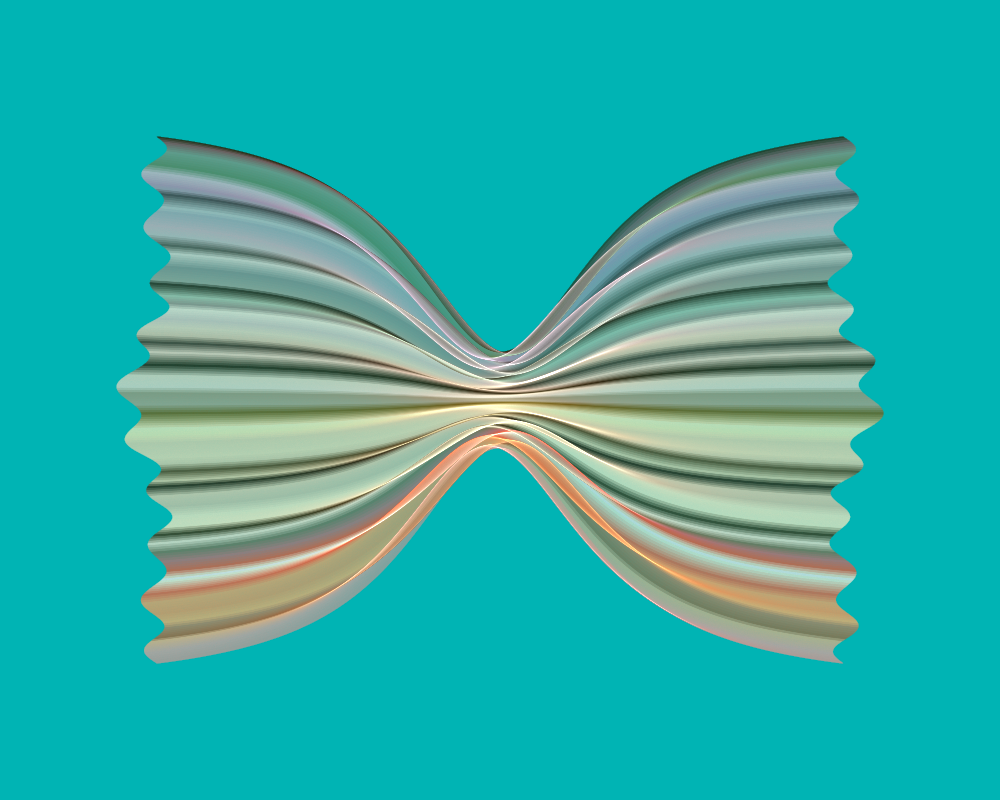
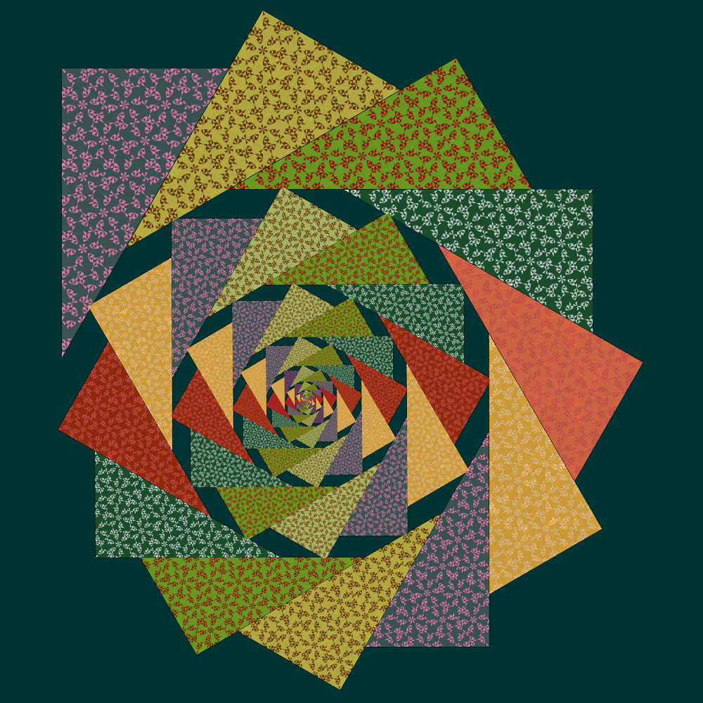

# Resources for the "New Features of JWildfire 5.50" video

Here are some resources for the video describing new features of JWildfire 5.50. You can watch the video at https://youtu.be/yEjj2fTtZT0.

## Links
[JWildfire home](http://jwildfire.org/) to download version 5.50

[Goldig Scripts](https://www.jwfsanctuary.club/download/goldig-scripts-by-michael-bourne/) by Michael Bourne, used to create the flame used to demonstrate layer density.

[Coherent Noise](https://fractalformulas.wordpress.com/2019/08/19/coherent-noise/) article referenced in the FastNoiseCreator description.

## Flames
[Goldig flame](Goldig.flame)

[Farfalle flame](Farfalle.flame)

[Harmonic octahedra flame](Ho.flame)

[TriTile spiral flame](TriTile_Spiral.flame)

## Script
The script I used to create the video is at [Script](Script.md). Note that I just used it as a guideline; the video doesn't follow it exactly. But I include it here for those who would rather read something than watch a video.
