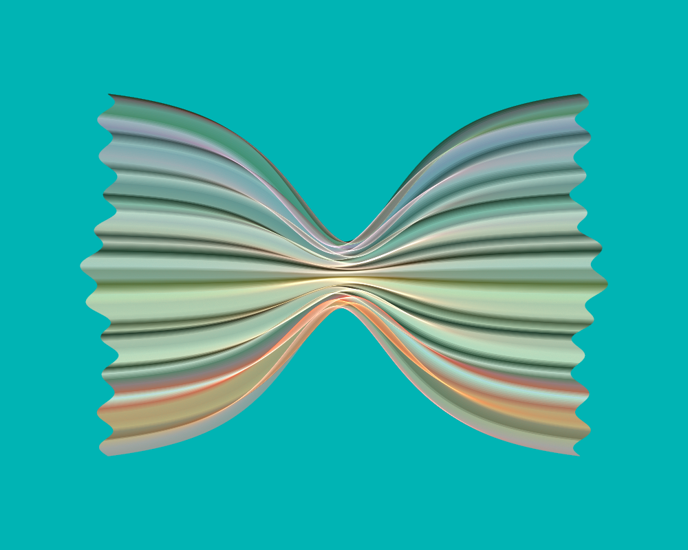
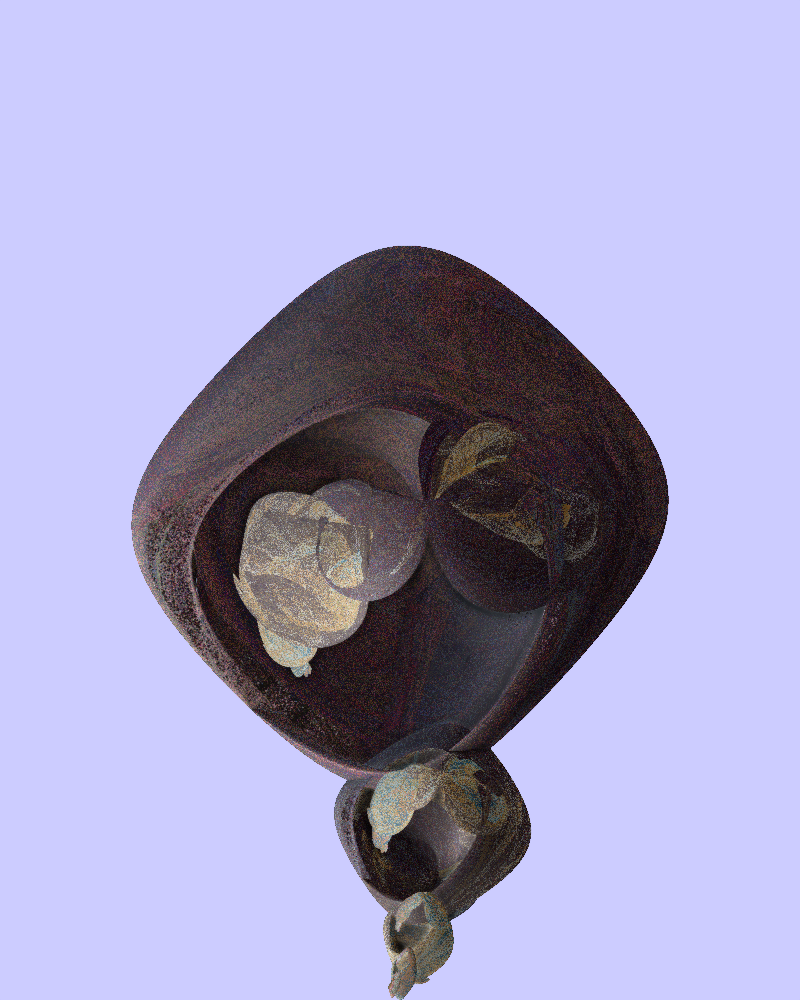
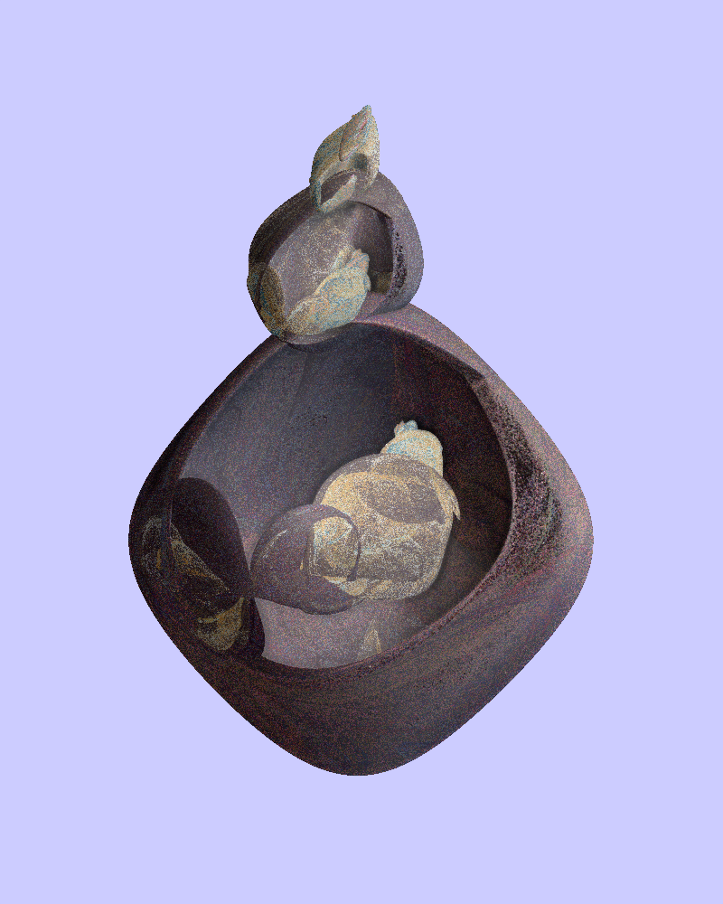
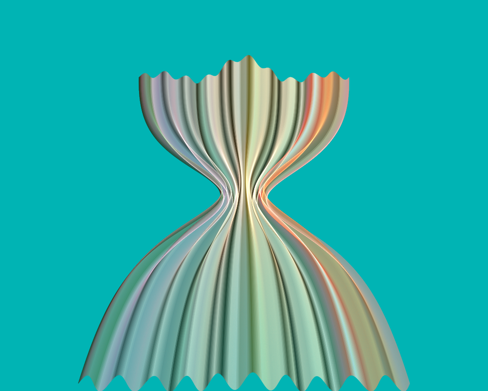
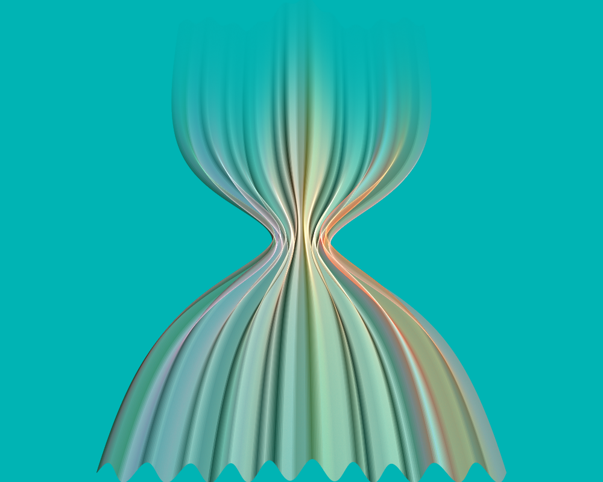
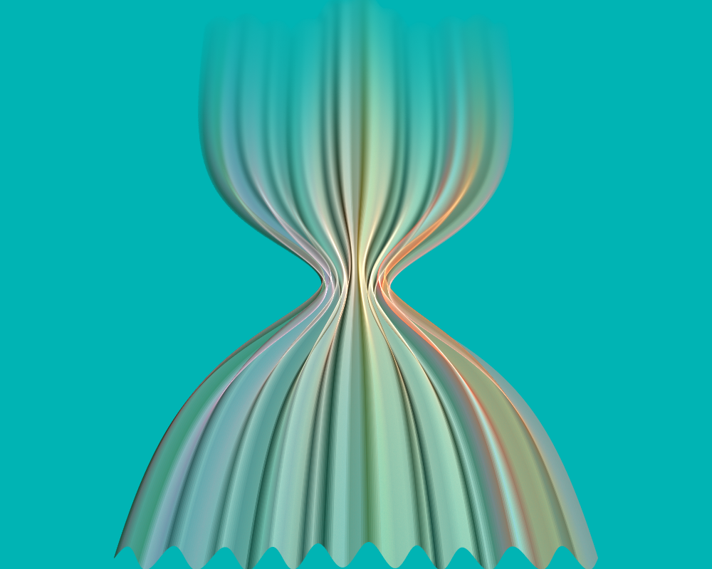
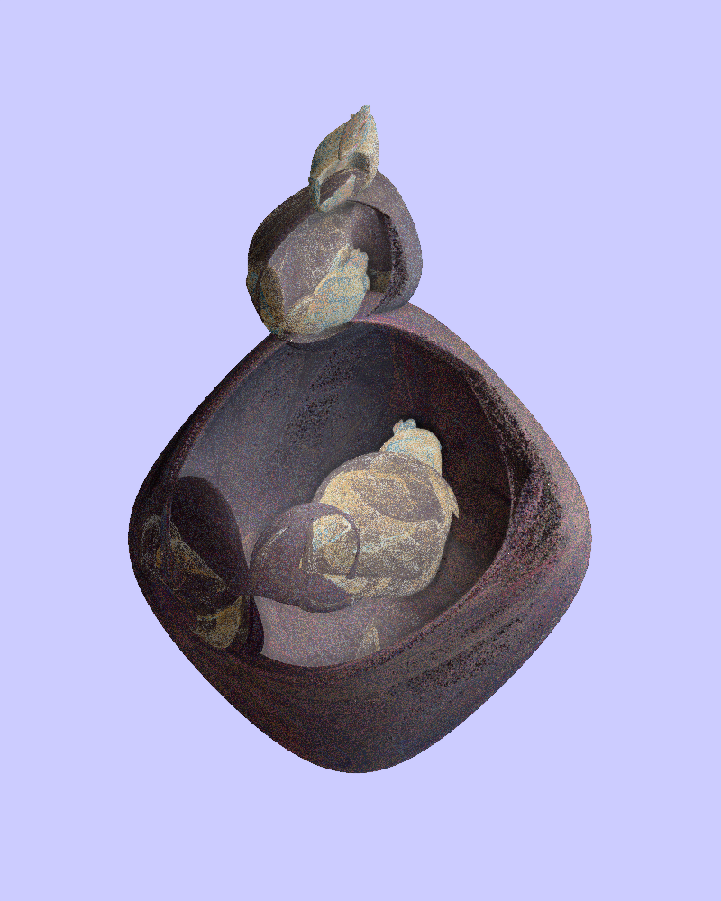
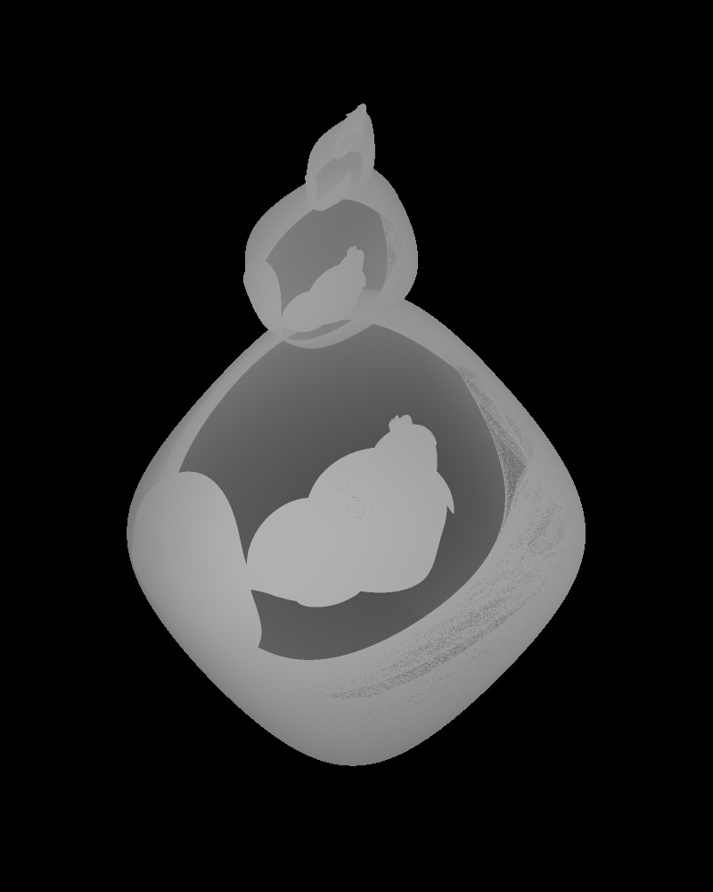

# New Features of JWildfire 5.50

## Introduction
*[Show the JWildfire home page, http://jwildfire.org/]*

On December 21, 2019, a new version of the popular open source flame fractal software JWildfire was released, version 5.50. It has a lot of new features; in this video we'll have a look at some of them. Let's start by running JWildfire and looking at the list of changes.

*[Switch to JWildfire showing a random flame. Show the list of changes following the script]*

To bring up the list of changes, click Help and choose "List of changes". Some have nice descriptions, such as the featured gradient curve editor. Some just have a single sentence. We won't be covering the new variations or added scripts in this video; nor will we cover things like the new tooltips or fixes. We'll stick to program features and changes.

## Layer density
*[Camera on me]*

We'll start with a new control for layers called layer density, which complements the layer weight control that has been around for a long time. Let's review layer weight so we can understand the subtle difference. Layer weight allows adjusting the intensity of a layer. A value of 1, the default, is normal. Increasing it makes the layer brighter, and decreasing it makes the layer darker. It isn't quite the same as the Brightness control on the Coloring tab but for most flames it works well to balance the brightness of the individual layers. Let's jump to JWildfire and look at an example.

*[Switch to JWildfire, with the two layer Goldig flame loaded; demonstrate following the script]*

This flame has two layers, both created starting with one of Michael Bourne's Goldig scripts, followed by some tweaking to make them my own. The flame has a white background and post symmetry across the x axis, which applies to both layers. I've left the layer Weight and Density settings at the default value of 1.

Let's look at the individual layers. I'll select layer 1 and click the Hide all others button to see what the first layer looks like by itself. *(Do a quick render.)* Now I'll select layer 2 and hide the others to see it by itself. *(Do a quick render of it too.)* Notice it is a bit lighter than layer 1; the gradient colors are lighter and more of the white background shines through. Clicking Show all shows both of them together. To even out the brightness, I select layer 1 (the darker one) and increase the weight. I'll go to 1.5 to make the difference obvious, but that's too much. A better value is 1.15. The difference is subtle, so here's a quick comparison so you can see the difference. Here is the original flame with equal weights.

And here is the flame with the adjusted weight.

Alternatively, we could take the brighter layer and lower its weight to balance the two. So let's set the weight of the first layer back to 1, and set the weight of the second layer to 0.9. That also balances the layers, though its a bit dark so we need to increase the flame brightness a bit (to 40) to compensate. The overall effect is different from increasing the weight of the first layer; here's a comparison. First, here is the flame with the layer one weight increased.

And here is the flame with the layer two weight decreased.

Both seem balanced; we can't say one is "right" and one is "wrong". It's up to the artist.

*[Back to JWildfire]*

Watch what happens when we take the weight all the way to 0. The layer is just as dense as before. All of the points are still there, but they are darkened to black. This is especially noticable since we're using a white background, though some of the shadows of layer two would show even with a black background.

*[Camera on me]*

Everything we've done so far isn't new; it works just the same as before. Now let's see how the new density setting works. Dense areas of a flame have more points than that areas that are not so dense, so the colors are more intense. Reducing the density will make them less noticable, letting more of the other layers and the background show through. The maximum value for density is 1; you can't make a layer more dense with this setting. At least one layer should have density 1 or the finished flame will lack density. But you can balance the density by making some layers less dense.

*[Back to JWildfire]*

Back to our flame, resetting the weights to 1. If we decrease the density of layer one, say to 0.5, layer two will be more prominent. On the other hand, let's put it back to 1, and decrease the density of layer two to 0.6. That makes layer 1 more prominent. Here's a comparison; first where layer one has lower density.

Next where layer two has lower density.

Both flames are equally valid; one isn't "better" than the other. The "right" one depends on the artist's intent. I personally prefer the second one, but it isn't inherently better.

*[Camera on me]*

If we take the density for a layer all the way to 0, the layer has no density and doesn't show at all. It has the same effect as turning off its visibility. We can use this in animations to fade from one layer to another. Let's use motion curves to make this flame fade from layer one to layer two.

Animations do need to be planned in advance. Here's what we'll do: For frames 1 to 10, we'll show only layer one and hide layer two by setting its density to 0. Then we'll make a 40 frame transition from layer one to layer two, frames 11-50. Then frames 51-60 will show only layer two, keeping layer one hidden.

*[Show JWildfire screen]*

So to program that into the flame, we first enable motion curves. Then we select layer 1 and edit the density motion curve. We'll set the interpolation type to LINEAR, and note that the first point on the motion curve is there and correct: frame 0 with value 1. We add a second point by clicking Add point, then clicking somewhere in the graph. It's hard to get it precise, so we'll just click anywhere, then set the values manually: frame 10 with value 1. We add a third point and set it to frame 50 with value 0 to fade layer 1 out between frames 10 and 50. And we add the last point with frame 60 and value 0 for the last ten frames. Now we can click View all to see the entire curve. Looks good, so we Apply and close to finish.

Next we select layer 2 and edit its density motion curve in much the same way. Interpolation to LINEAR, but frame 1 starts with 0 since this layer is hidden at the start. The second point is at frame 10, also with value 0. The third point is at frame 50 with value 1 to fade the layer in. The last point is at frame 60 with value 1 to keep this layer visible the rest of the animation. View all shows it nicely, and we apply the curve. Finally, we set the Frame count to 60, the number of frames in our animation.

Clicking Play shows the animation, but it goes too fast to render well. Turning off Realtime helps a bit, but the best way to get a feel for what it does is to turn Realtime back on and manually drag the slider or use the Frame step buttons. Even better, render it! Here's what it looks like.

*[Show rendered movie]*

## Layer extract
*[Camera on me]*

Another way to make animations is using the Easy movie maker. It has a change in version 5.50, so we'll go look at it, but it wants the layers as separate flames. Which brings us to the next new feature: the layer Extract button.

*[Show JWildfire, with the edited Goldig flame, on the Layers tab]*

It is on the bottom right of the Layer tab and extracts the current layer as a new flame. So we'll select layer one and click it. A new flame appears at the top of the thumbnail bar containing the layer as a new flame. Now we select layer two and click Extract again. Another new flame appears in the thumbnail bar with this layer. And voila! We have the two layers as separate flames, ready for the Easy movie maker.

## Easy movie maker FADE change
Well, they aren't quite ready; we need to disable the motion curves first. Let's load the first flame, click the Density motion curve button, and click Disable motion curve. Now we click the Movie button to open the Easy movie maker. Since no flames have been added to it, the flame from the editor is automatically added. We switch back to the editor and load the second flame, disable its motion curve, go back to the movie maker, and click Add from editor to add it to the flame list. The first flame includes the transition, so we'll set its Duration to 50 frames, 10 by itself and 40 for the fade, and set the Morph to 40. The default Morph type is FADE, which is what we want. We set the Duration for the second flame to 10 frames. The Morph length and Morph type are ignored since it is the last frame. That's it! The easy movie maker isn't quite as flexible as motion curves, but it as easy as the name suggests.

We can preview the movie using the Play button, or drag the slider to a frame we want to see and click Render to see a higher quality preview. If we click E, it loads the current frame into the editor and we can see that it has two layers much like we had before. The density of the layers is intermediate, showing parts of both flames. If we were to render the movie, it would look pretty much the same as the one we did with motion curves.

This is actually a change in version 5.50. Earlier versions used layer weight to fade the flames, so the first flame faded to black and disappeared while the second flame appeared black and faded in. Using density works better for fading. But we can still get the old behavior if we want it by checking the Compatibility box on the bottom right of the movie maker. If we do that for this flame, the result is rather murky. If we click E to load it in the editor, we see that it has two layers with the layer weights adjusted.

## Bank control
*[Camera to me, holding model airplane for demonstration]*

A three dimensional object can rotate in three different ways. For example, take an airplane. We can rotate the nose up or down, called pitch or elevation; we can rotate the wings up or down, called roll or bank; and we can rotate the plane right or left, called yaw or heading. JWildfire has always had three controls named roll, pitch, and yaw. Pitch and yaw rotate the flame, but the roll control actually rotates the camera; until now there hasn't been a way to rotate the flame around the y axis. Version 5.50 adds a control to do this, called bank since roll is already used. Let's have a look at it.

*[Switch to JWildfire with the parplot2d_wf flame loaded, on Camera tab with all rotations at 0]*

Here is a flame that uses the parplot2d variation to create a two dimensional surface warped in three dimensions. It uses preset 33, aptly named "Farfalle" since it looks kind of like a farfalle or bowtie pasta (though it has a lot more creases). It has a small amount of Perspective, which makes closer parts appear larger so that when we rotate it we can see which way it is going. And we have a teal background.

*[Demonstrate controls as directed]*

The Pitch control rotates the flame around its x axis. If we increase pitch, we see that the top of the object moves away and the bottom moves closer. Negative values do the opposite, moving the top closer and the bottom away. We'll set it back to zero, then change yaw. Increasing and decreasing yaw rotates the object around its z axis; since we are viewing it from the top, it is just a rotation. Since pitch and bank are both 0, it has the same effect as changing roll, which rotates the camera, although the rotation is in the opposite direction. Those controls haven't changed. We'll set them back to zero, and change the new Bank control, which rotates the flame around its y axis. Increasing bank moves the right side of the flame away and the left side closer; negative values do the opposite.

Of course, we can combine these. Positive values for both bank and pitch move the top right away and the bottom left closer. Changing yaw rotates the object as we expect. Note that changing roll now is different from changing yaw; it works, but it can get confusing.

*[Camera on me]*

I personally recommend using roll only for two dimensional flames, leaving the others at 0, and using only pitch, yaw, and bank for three dimensional flames, leaving roll at 0. It makes things behave a bit more intuitively.

To see how this new control can be useful, let me load a flame I made last summer, a solid flame based on hyperbolic octahedra using the ho variation.

*[Switch to JWildfire with the Ho flame loaded, on Camera tab]*

This is the flame without any rotations. I want the large bulb on the bottom so I'll set Yaw to 180 to turn it right-side up. I'll move it down a bit by decreasing CentreY, and do a quick render to see what we have. The top needs to come forward, so I'll decrease Pitch. That's better, but I want the light part to be more centered. That's easy now; just decrease Bank.

Before Bank, it could be done but it was hard. I'll set Bank and Pitch to 0, and instead of setting Yaw to 180, set it to -90 and set Roll to 90; that turns it right-side up. But watch what Pitch does now; it rotates around the y axis! We've managed to switch the axis Pitch works on, so we can decrease it to center the light part. A useful trick before Bank, but this is why I recommend leaving Roll at 0 when you adjust Pitch and Bank; it changes the axes they rotate around, which can be confusing. This flame still leans back, but we can't use Pitch to fix that now. We could use Bank now, but in the older version we would need to set Yaw and Roll to other values. For example, if we set Roll to 60 and Yaw to -130, decreasing Pitch allows us to get the orientation we want. Bank makes this a lot easier!

## DiminishZ color
To show the next feature, let's go back to our farfalle flame and set Pitch to about 30, and Yaw to 90 so we're looking at it along its long axis.

*[Show JWildfire with the Farfalle flame, with Pitch 30 and Yaw 90]*

Because of the perspective, the near end is larger than the far end; we can make the far side longer by increasing the parplot2d_wf umax parameter to 5. Now we go to the DOF/Bokeh tab. We'll be looking at the DiminishZ control, which isn't new, but has a new feature. DiminishZ adds a haze to the parts of the flame that are further from the camera. Let's set it to 0.2; notice how the far part is now black, which would be great if the background was black, but it isn't. The new feature in this version is the ability to set the color that DiminishZ uses. We do this by clicking the DimZ color swatch. We'll choose a color that is slightly darker than the background; it can take some experimentation to get just the right color. Now the flame disappears into the background. This adds a nice illusion of depth; it's a well known effect called atmospheric perspective.

DiminishZ can be used in conjunction with Depth of Field blur. Let's reduce the DiminishZ value to 0.1 and set the DOF amount to 0.5; now the distant parts are both faded and blurry.

The DimZ distance control is also new to this version. Before, the DiminishZ distance was controlled by Camera dist; now they can be set to different values. Here, they are both set to 0 right now, but we can increase DimZ dist to start the DiminishZ effect closer to the camera. Or we can decrease it to make it start further away.

## New ZBuffer controls
*[Camera on me]*

Another tab under DOF/Bokeh that has some changes is ZBuffer. The Z buffer, also called the depth map, tracks how far different parts of the flame are from the camera. The "Z" refers to the camera's z-axis, not the flame's. JWildfire uses it internally to figure out which areas are hidden by closer parts, but it can be saved for use in postprocessing images, for example to simulate shallow depth of field or to add fog. A common use recently has been to generate 3D images in Facebook and other programs.

In previous versions, the ZBuffer file was named "zbuf"-underscore followed by the image filename. That is still the default, but Facebook requires that depth maps be named the image filename followed by underscore-"depth", and version 5.50 has an option to select that name if desired.

*[Show JWildfire with the Harmonic octahedra flame]*

The Z buffer is only used with solid render mode, so let's switch back to the hyperbolic octahedra flame. In the DOF/Bokeh section is a tab labeled ZBuffer. Let's go there and change the filename to use name_depth.

To save the ZBuffer along with an image, create a quality profile that has "with Z-Buffer" checked. I have one here, called "100-Z". (I prefer to name my quality profiles using the quality rather then vague terms like "high" and "low".) We'll choose it and render the flame. It's a relatively low quality so will render quickly. JWildfire opened both the main image and the depth map; we see that the background is black and closer areas are lighter.

*[Switch to Facebook window, ready to upload an image]*

Let's load this into Facebook. We click Photo/Video and select both the image and the depth map, and after a minute Facebook has created a 3D image for us. But it doesn't work well; there are white areas that are rather annoying. Basically, the black background is so black that it confuses Facebook.

*[Camera on me]*

To fix this, we could edit the depth map in a photo editor and lighten the background. But JWildfire 5.50 has a new feature to help us avoid this: ZBuffer bias, which adjusts the background value. The best value depends on the flame, so some trial and error may be needed. Setting the bias will essentially make the background appear closer. But we don't want the background to be in front of the farthest areas of the flame, so start low and go up.

*[Switch back to JWildfire]*

I've played with this a bit and found for this flame a value of 0.07 works well. Let's put that in and render. A quick check on the depth map shows the background isn't completely black, but it looks darker than the darkest areas of the flame.

*[Switch to Facebook window]*

So let's load it in Facebook. There are still some weird black streamers, but the white areas are gone.

*[Camera on me]*

One thing I've discovered when playing with this is that Facebook really prefers depth maps to use white for far-away areas like the background, with closer areas darker. As we've seen, it does detect when the opposite is used and makes it work. But for technical reasons, white for the background works better. And JWildfire can do that! All we need to do is change the ZBuffer scale to -1. This is not new to 5.50; earlier versions did that too, but nobody realized it.

*[Switch to JWildfire, then Facebook, as indicated]*

Let's render one more time after changing ZBuffer scale to -1 and ZBuffer bias back to 0. As we can see, the depth map colors are now reversed. And when we load it into Facebook, not only are there no white areas, but the black streamers are gone too.

## New Gradient Features

*[Camera on me]*

There are several new features in the Gradient tab. The gradient curve editor in particular is really nice, but let me point out a couple of other new things before we go there.

*[Switch to JWildfire, with Farfalle flame loaded, showing Gradient tab]*

There are two new buttons right above the gradient display: Random and Save. These buttons aren't new. Random is the same as clicking Random Gradient in the Create new section, and Save is the same as clicking Save in the gradient editor. But they are duplicated to the main section so they are more convenient now.

The Create new section has a new button: Create similar gradient. Click it to generate a new gradient that is based on the active one. It's nice when you like the colors but want something different. We can click it repeatedly to get new gradients, but keep in mind that each will be based on the previously created one, not the original one before we started clicking it.

One more change in this section: There are two new gradient generators in the list: Uniform curves and Uneven curves. These specifically use the gradient curve editor to create a new random gradient. Let's choose Uneven curves with 12 random points and click Random gradient. Now let's click Curve editor and have a look at this very powerful new feature.

We see three grids with curves in them, one each for hue, saturation, and luminosity. Left to right corresponds to gradient positions, and top to bottom corresponds to values for hue, saturation, or luminosity. As we move points around, we see the gradient change, and the flame is colored to match the new gradient. This gives very fine control over the flame coloring.

Learning to use the gradient curve editor is best done by doing. Just move points around and see how the gradient and flame are affected. That will develop intuition for how the curves work. But some systematic fiddling might help. Notice the buttons to the right of each grid. For hue, we'll click the second button, which arranges the points going right from bottom to top. For saturation, we'll click the third button which sets them all to 0, sucking out all of the color, then we'll click the bottom button to reverse the curve top to bottom, giving all the colors full saturation. Finally, we'll click the fourth button for luminosity, making all the colors pure; no tints or shades. That gives us a rainbow gradient! Although real rainbows don't have the purple and red colors on the right side. Now we can move points around to see how they work. So increasing luminosity adds white, giving tints of the color, and decreasing it adds black, giving shades. Lowering saturation reduces the vibrancy of the color. Moving a hue point changes the corresponding color.

The gradient curve editor has another important feature. Let's go to the gradient library and select a gradient, one with lots of colors. Switching back the curve editor, we see curves that represent the new gradient. But not exactly; there are only a dozen points. The curve editor is inactive until you click in it. Then it replaces the gradient with the simpler approximation defined by the curves. The gradient curve editor is difficult to use when it has lots of points; they just get in each other's way. So this give an approximation of the gradient that can be edited more easily.

One more thing: we can edit a gradient curve with the motion curve editor by clicking the top button next to the curve. This allows much more precise editing with additional features like adding and removing points and using Bezier or linear interpolation. But, there's a tradeoff: you don't get real-time feedback as you change the curve.

## CYCLIC coloring type

*[Camera on me]*

Version 5.50 also has a new coloring type: CYCLIC. It's a bit more specialized than the others, but has some important uses. Like the standard coloring type DIFFUSION, it is based on the gradient. But unlike DIFFUSION, it doesn't converge to a specific point; it just cycles the colors around the gradient. Specifically, it adds the speed value to the current gradient index, wrapping around to the other side when it hits the edge. It's main use is for tilings where you want the colors to cycle through the tiles. Since it doesn't converge, it can't be used by itself; other transforms need to have the DIFFUSION color type to focus the coloring.

CYCLIC is also useful for linear spirals; let's look at an example.

*[Switch to JWildfire, with the dc_triTile spiral showing]*

The top left patterned triangle here is made with dc_triTile, and uses DIFFUSION coloring. The second transform rotates, moves, and shrinks it slightly; when iterated it makes a spiral from copies of the original triangle. CYCLIC works well as the coloring type here to keep the colors and the pattern bright but different through the iterations. For contrast, here's what it looks like using DIFFUSION; the colors converge to a single color. Switching back to CYCLIC, note the speed is 0.1667, which is about one sixth. This gives a cycle length of six. If we count the triangles starting at the first: 1, 2, 3, 4, 5, 6, we see that the color pattern repeats itself every six iterations. So number 7 is the same as 1, 8 is like 2, 9 is like 3, and 10 is like 4. It looks like 11 is off; it isn't like 5. The reason for this is a combination of the high frequency gradient we are using and the fact that 0.1667 isn't exactly one sixth. If we add another digit of precision, 0.16667, we get what we expect.

We can change the cycle length by changing the speed. If we set it to one fourth, 0.25, the cycle repeats every four iterations. Or one tenth, 0.1, makes it repeat every 10 iterations. How about 0.3? That's three tenths, so it also repeats every 10 iterations, but the colors are different from 0.1. Let's try 0.33. That doesn't seem to repeat at all! Actually, it does, but 0.33 is thirty-three hundredths, so the cycle length is 100, too long for use to see it repeat. Let's keep going; 0.333 is 333/1000, but that is close to one third. Indeed, we start to see it repeat every three iterations, although the colors aren't exactly the same. Adding one more three, 0.3333, gets it close enough to one third that we get an exact match every three iterations.

One more addition to JWildfire 5.50 is a description of the various coloring types. To see it, choose Windows->Fractal flames: Help and click the JWildfire Coloring Types tab.

## FastNoiseCreator

*[Camera on me]*

The last new feature is in the image processing part of JWildfire rather than the flame fractal editor. JWildfire version 5.00 included the FastNoise library by Jordan Peck to support the weighting field feature added to that version. Shortly after that, I wrote an article describing how coherent noise worked, and I needed a way to create noise examples for it. So I added a feature to the JWildfire image processing module to use the FastNoise library to do this.

*[Switch to JWildfire and follow along]*

To use this, we select Window->Image processing to open the image processing module. We then click the Create image tab and select FastNoiseCreator. If we just use the default settings and click Create, we get an image with PerlinFractal noise colored like clouds in the sky. Let's change the colorMode to Gray by double-clicking and and choosing GREY from the list, and let's also increase the frequency to 5, again by double-clicking and typing 5 and Enter. To get a different pattern, we change the seed value. Notice how the noise is similar, but has different details.

We can get different kinds of noise by changing noiseType. Most of the types are coherent noise; see my article for more information on the various parameters. But some other types can be selected, such as Cellular noise.

## Ending
*[Camera on me]*

Well, we've come to the end of our quick tour of JWildfire 5.50 features. Hopefully you've learned a few tricks along the way. I've certainly learned a lot making this video! The best way to learn these is by doing, so go play with these features on your own flames. Thanks for watching.
