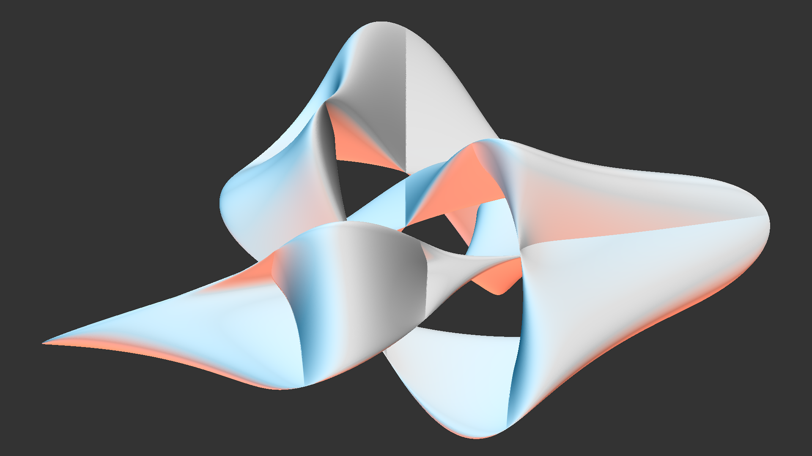

# Resources for the "JWildfire Light Settings" video

Here are some resources for the video describing light settings for JWildfire solid renders. You can watch the video at https://youtu.be/C6kmYwAK8qI.

## Links
[JWildfire home](http://jwildfire.org/) to download version 5.50

## Flames
[Sphere and Cube](SphereCube.flame)

[Sphere flame](Sphere.flame)

[Trianguloid Trefoil flame](Trefoil.frlame)

[Animated Trianguloid Trefoil flame](TrefoilAnimation.flame): The above flame but with motion curves on the light Altitude and Azimuth controls; used in the video's opening

[Color Trianguloid Trefoil](TrefoilColor.flame): The above flame with additional colored lights, as described at the end of the video (though the settings are slightly different)

## Script
The script I used to create the video is at [Script](Script.md). Note that I just used it as a guideline; the video doesn't follow it exactly. I include it here for those who would rather read something than watch a video.
