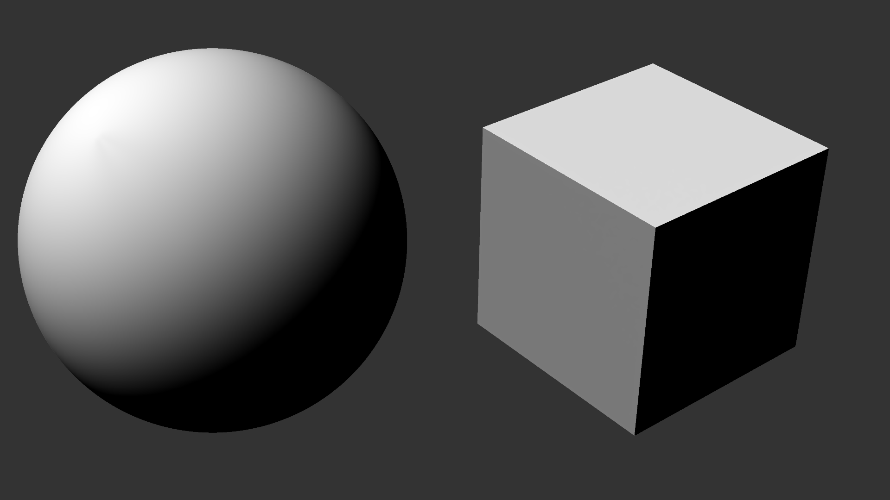
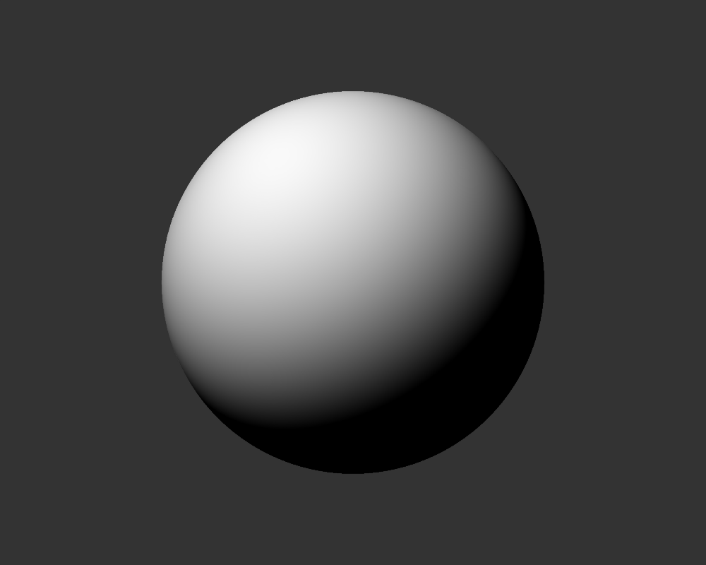
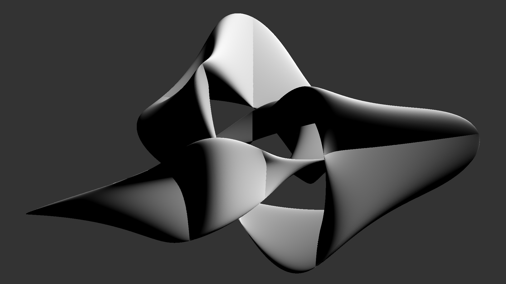
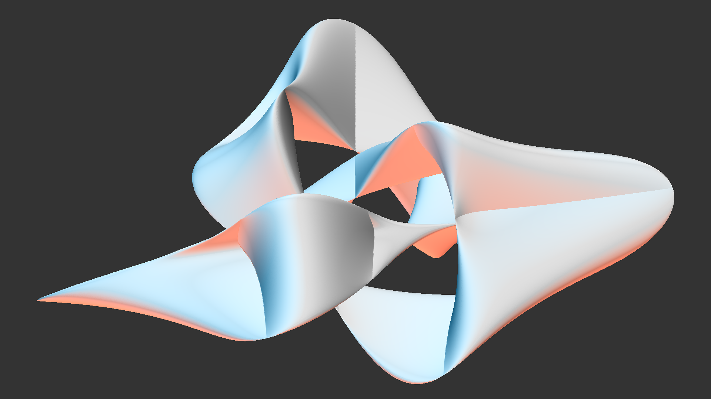

# JWildfire Light Settings

## Introduction
*[Show introduction video of a JWildfire object with lights moving and changing brightness/color]*

JWildfire can render 3D flames as solids, with custom lighting and materials to show off their three dimensional form. In this video, we'll look at how to control the lights, including their direction, intensity, and color. Materials, which control how the lights interact with surfaces, and shadows are also important for solid rendering, but we won't cover them in detail here.

## Directional Light
*[Camera on me]*

We'll be using JWildfire version 5.50, the latest one as this video is being recorded. It has only one type of light, which in the 3D graphics world is called *directional light*. But JWildfire just calls it a *light* since there aren't any other types. Directional light doesn't have a specific source, but it travels in a particular direction, which we can specify. This light hits every point on every surface with the same direction and the same intensity, and does so independently of any other point or object. So it doesn't inherently cast shadows. JWildfire can compute shadows by tracing a path from a point in the opposite direction of the light and seeing if it hits anything, but that is a separate function which we won't get into here.

Even though there is technically no source for directional light, it can be helpful to think of it as coming from a source very far away, like the sun. Indeed, directional light is used in many 3D graphics programs to model sunlight or moonlight because it has similar characteristics. It's more intuitive to think of the direction to the source instead of the direction the light is traveling. But remember that, unlike sunlight, other objects won't get in the way and create shadows; shadow generation in JWildfire is a separate process.

The light direction is important because it determines how brightly each point on a surface will be illuminated. A point that faces the light will be bright. A point that faces slightly away will be less bright. A point that faces the opposite direction won't be lit by the light at all. This gradation of lighting is what gives solid objects a three dimensional appearance.

*[Show the image of sphere and cube]*

To see how this works, let's compare how a sphere and a cube are affected by directional light. The background is dark gray so we can see the black unlit sides of the object. They are lit with a single light we can imagine is up and to the left and slightly towards the camera, casting light whose direction is down and to the right and slightly towards the back. The brightest spot on the sphere is the point facing the light. From there, the points face gradually away from the light, so get dimmer. Points facing the opposite direction of the light aren't affected by it. It's important to understand that these points are not black because the points are in the shadow of the other side of the sphere. They receive the same intensity of light as the other points, but they are facing the wrong direction so ignore it.

The cube is a bit different, but the same principles apply. All the points on a given face of the cube face the same direction, so are shaded the same. On the top face, the points face somewhat towards the light, but not directly towards it, so have a light shade. The points on the left face are facing further away, but still somewhat towards the light so get a darker shade. The points on the right face don't face the light at all, so are black. Again, this is because of the direction they are facing, not any shadow effect.

## JWildfire Light Direction
With this background, let's go to JWildfire and see how to control the lights.

*[Switch to JWildfire with Sphere flame loaded.]*

It's easier to see how the controls work with the sphere, so that's what is loaded here. It is made using the parplot2d_wf variation, with preset 39. Solid render mode is enabled, and the Camera settings are at the default, so the x axis is horizontal, the y axis is vertical, and the z axis is facing the camera. The material is set to use only diffuse light, which is the light that we'll now play with. JWildfire supports multiple lights, and we normally want more than one, but we'll start with a single light to keep it simple.

The most important setting is, of course, the direction of the light. It is set using the Altitude and Azimuth controls. Using altitude and azimuth is a standard way to specify direction, although the JWildfire use is a bit unconventional. But notice the asterisks next to Altitude and Azimuth. That means that changes to them will show in the preview without re-rendering, but the preview does need to be rendered first. Let's be sure by clicking the Render preview button. We can see the progress in this indicator, but it is just for the flame rendering; it takes a bit longer after it reaches 100% to render the solid.

Let's start by setting both Altitude and Azimuth to 0. That puts the light on the negative z axis, pointing toward positive z; with no rotation, that means it points towards the camera, illuminating the back of the sphere so the side we see is black. If we change Altitude to 90 degrees, the light moves up, which is logical for a control named Altitude. It is pointing straight down, so the top half of the sphere is lit. Now that we see the light, let's use the Altitude slider to increase it further. As we see, that moves the lit part down as the light moves down to the level of the camera. At 180 degrees, the light is pointing the same direction as the camera, lighting the entire half we can see.

Going further, we have a choice. We can continue to increase Altitude past 180; it will reach the bottom and point straight up at 270 degrees. Or we can change the 180 to negative 180, which is the same direction, and increase it from there; in this case it will point straight up at -90 degrees. Since 270 and -90 are the same angle, it doesn't really matter which we use.

Let's set Altitude back to 180 and change Azimuth. As we increase it, the light moves to the right. When it reaches 90 degrees, it is directly to the right, lighting the right side of the sphere. The opposite happens when we decrease it; at -90 degrees it is directly to the left. Now let's decrease the Altitude to 130 and try again. Increasing Azimuth now still moves the light to the right, but it also moves it down, so when it reaches 90 it is again directly to the right side. This is the tricky part: When Azimuth is 90 or -90, the light is always directly to the side and changing Altitude doesn't have any effect. Because of this, I like to set Altitude first, at least roughly, with Azimuth set to 0, then change Azimuth to get the light where I want it. Then I fine tune both. Setting Azimuth first runs the risk that it will be close to 90, and then Altitude won't do much.

## Lights and Flame Rotation
*[Camera on me]*

So far, so easy. With the flame rotations all 0, changing light altitude and azimuth have a predictable effect on the light direction. But the lights are relative to the flame, so rotating the flame will rotate the lights as well. Sometimes, this is just what we want, and sometimes minor lighting tweaks may be needed. But when a large rotation change is made, the lights will probably be completely off and we need to start over with the lights. To avoid this, it's best to figure out the rotations before spending too much time on the light positioning.

But positioning the lights when the flame is rotated is a bit harder since "up" may be any direction. It can be helpful to move the lights around a bit to see what direction is what. Rotating a sphere doesn't change it, so let's pick a different shape, the one you saw in the opening animation. It is called a trianguloid trefoil, and we get it using parplot2d_wf preset 26.

*[Switch to JWildfire, with the static version of the trefoil flame loaded, Camera tab selected]*

To get this orientation, the Pitch, Yaw, and Bank settings are non-zero. Let's switch to the Light settings and see how they work here. I like to start by setting both Altitude and Azimuth to 0. If that leaves the flame mostly black, as it does here, change Altitude to 180 to move the light to the other side of the flame. Now we move the Altitude slider back and forth to see how it affects the light direction. Here, Increasing Altitude moves the light left and decreasing it moves the light right. Now we set it back to about 180 and see what Azimuth does. It's generally perpendicular to Altitude, so as expected it moves the light up and down. So keeping in mind we want to set Altitude first, we set Azimuth back to 0 and find a nice altitude value. Maybe around 200. Now we set Azimuth; -60 looks OK. Now we go back and forth to find a nice position. So maybe 140 for Altitude, and I like -50 for Azimuth. And I just keep going until any change makes it worse, or until I get tired, whichever comes first. (I stopped at 85 and -75 when writing this script.)

## Multiple Lights
With a single light, there will always be some black spots that face away from the light. We need a second light to illuminate them. It's easy to add one, just click the Add button next to the light selection dropdown. The idea is to add some fill light, not to overpower the flame with bright light. So the first thing I do is reduce the Light intensity to, say, 0.5. But it's still hard to see the new light with the first light shining so brightly, so let's go back to the first light and turn it off by changing the intensity to 0. Note that you need to re-render the preview when you change lights, or it looks rather awful. But I'll switch back to light 1 first.

Adjust the second light the same way as the first, but keep in mind that we want it to illuminate the parts that face away from the first light. So we set Altitude and Azimuth to 0, and as before change Altitude to 180 to get the light closer to where we want it. This is actually pretty close; the areas that were black with just light 0 have some light now. But we can tweak it a bit, perhaps to 190 and 15.

Now we can go back to the first light, light 0, and set the intensity back to 1. The dark areas are filled in, though it is a bit bright where the lights overlap. So let's reduce the intensity to 0.9.

Sometimes more lights are needed to fill in areas that aren't covered. In this example, there are a couple of places that are pretty dark, but I personally like them. I think they help define the 3D shape. So I won't add another light. But that is easy to do: just click the Add button again.

## Other Light Settings
The other settings here are straightforward. We've already discussed Light intensity; it makes the selected light brighter or dimmer. As I already mentioned, shadow calculation is a separate function, not something that the lights do themselves. The Cast shadows checkbox will only work if hard shadows are enabled and specifies which lights will be used in shadow calculation. If shadows are enabled and Cast shadows is checked, then Shadow intensity will control how dark the shadows will be from the selected light. But shadows are another topic that we won't cover here.

There is one more setting here: Light color, which is just what it sounds like. It lets us use colored lights. Click the button with the die to set it to a random color, or click the color swatch to select a color yourself. Changing the color of the main light just results in a mostly monochrome image, which is fine if that suits your artistic intent. I personally prefer to keep the main light white. To add color, we can add additional colored lights, which produces a more subtle effect.

So let's add another light, and give it a color. Move it around to get a nice effect, and adjust the intensity as needed. Darker colors will generally need more intensity than lighter ones. Then add yet another light with a different color and do the same thing.

## Ending

*[Camera on me]*

Well, that's the basics of light settings for JWildfire solid renders. Thanks for watching. The best way to learn this is to do it. As you play with the settings and see what effect they have on your own flames, you will develop an intuition for how to use them to make your solid flames look their best.
