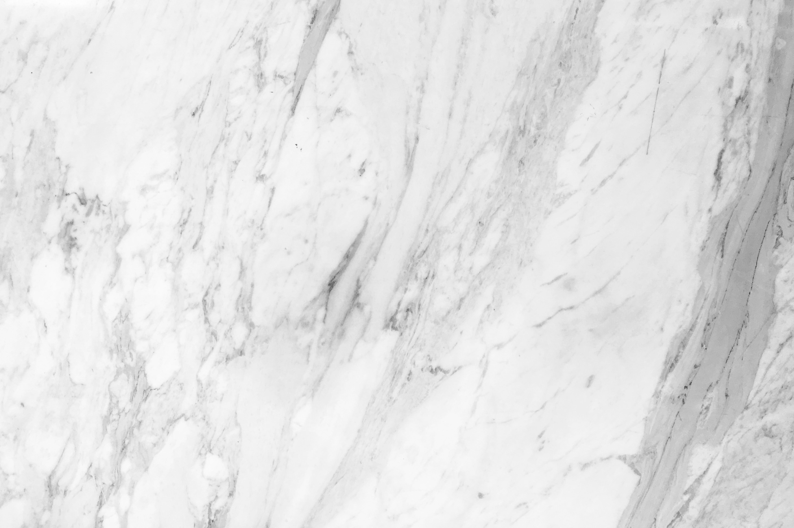
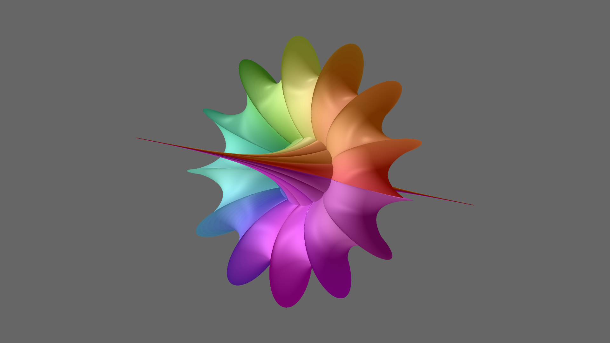
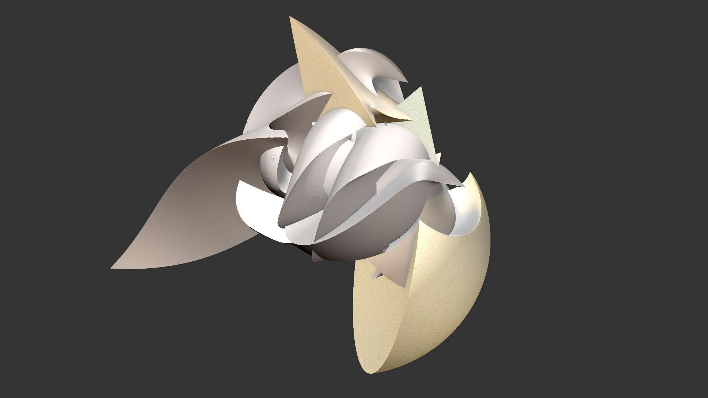
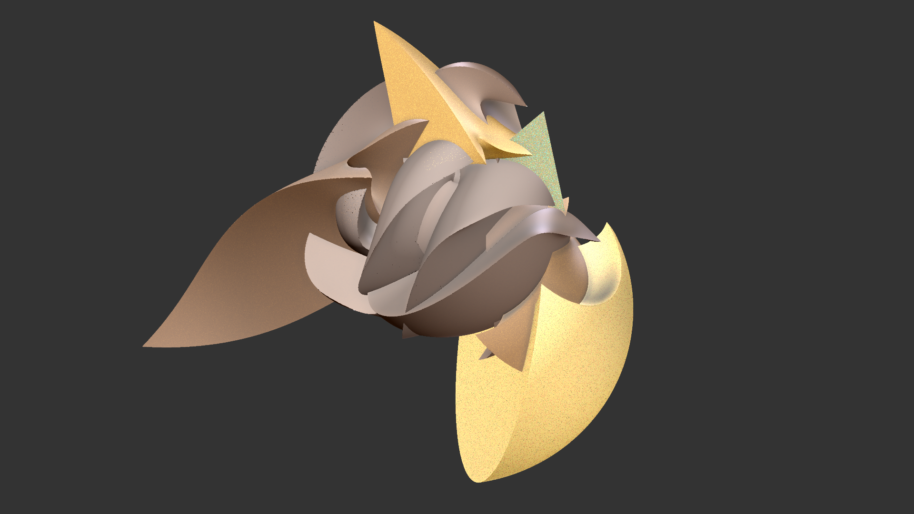
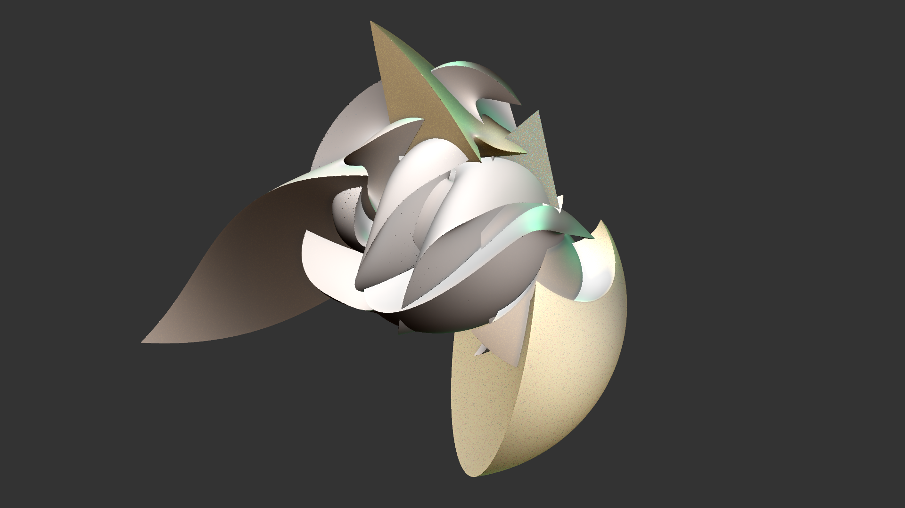
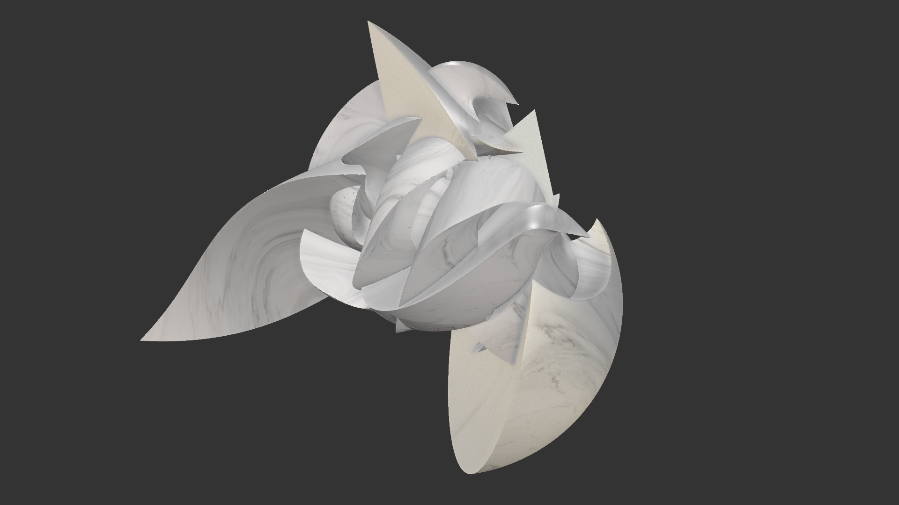

# Resources for the "JWildfire Materials" video

Here are some resources for the video describing materials for JWildfire solid renders. You can watch the video at https://youtu.be/dI3dsXZUrdo.

## Links
[JWildfire home](http://jwildfire.org/) to download JWildfire

Marble surface photo by Henry & Co. at Pexels: https://www.pexels.com/photo/marble-surface-2341290/

## Flames
[Breather flame](Breather.flame), the one used in the video to demonstrate materials

The opening sequence has four flames, differing only in the material settings:  
[Tetrafoci1.flame](tetrafoci1.flame)

[Tetrafoci2.flame](tetrafoci2.flame)

[Tetrafoci3.flame](tetrafoci3.flame)

[Tetrafoci4.flame](tetrafoci4.flame)

## Script
The script I used to create the video is at [Script](Script.md). Note that I just used it as a guideline; the video doesn't follow it exactly. I include it here for those who would rather read something than watch a video.
