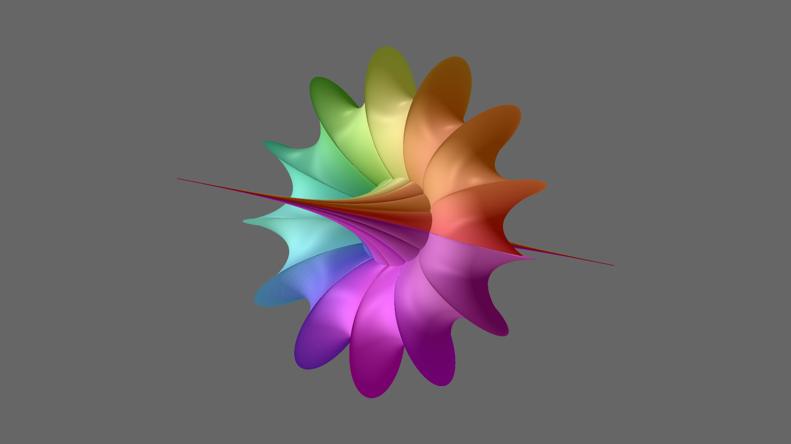

# JWildfire Materials

## Introduction

JWildfire can render 3D flames as solids, with custom materials and lighting / to enhance their three dimensional form. In this video, we'll look at the material settings, / which lets us balance the effects of the lights and flame coloring, and lets us add / textures from an image. We'll be using JWildfire version 5.50, the latest one as this video is being recorded.

## Phong Lighting
*[Camera on me]*

The reflection model used by JWildfire is based on Phong lighting, named for a computer graphics researcher at the University of Utah in the 1970's. The JWildfire implementation combines four different types of light: diffuse, ambient, specular, and a reflection map.

Diffuse light comes from the lights defined on the Light settings tab; it comes from a particular direction and is reflected equally in all directions, and models light reflecting from a matte surface, like a piece of paper. Points on the surface that face closer to the light direction are brighter and points that face away from the light are dark, regardless of where the camera is.

Specular light comes from the same lights as diffuse lights, but only reflects strongly in a single direction which depends on both the light direction and the direction the point on the surface is facing. This models a glossy surface. If the reflection is towards the camera, we will see a bright spot at that point on the surface; otherwise we won't see the reflection.

Ambient light models the illumination of objects in a darkened room or a deep shadow; it doesn't come from any particular direction, but lights all points evenly. In JWildfire, ambient light is the color assigned to the points by the flame coloring. This differs from the classic Phong reflection model, but allows the flame colors to show on solid renders.

JWildfire extends Phong lighting by adding a reflection map, which is just an image from a file mapped onto the surface. As the name implies, it can simulate the reflection of an environment in an object with a mirrored surface. More commonly, it can add a texture, like wood or sand, to a material.

The JWildfire Material settings tab allows setting the amount of each of these four components to define a material with specific properties. Let's have a look.

## JWildfire Material Settings
*[Switch to JWildfire with Breather flame loaded]*

Here is a 3D solid flame made with parplot2d_wf, using preset 23, a surface called a "breather". Since we are focusing on materials, both the ambient and the hard shadows are turned off. We'll go to the 3D rendering panel at the bottom, and select the Material setting tab. The amounts of the four material components are controlled by the Diffuse, Ambient, Specular, and Refl intensity values. Note the asterisks next to the names; this means that changing them will change the rendered preview without having to re-render it. But it does need to be rendered before adjusting them, so lets click the Render preview button and do that now.

To begin, let's set all four values to 0, so the flame has no lighting at all. That makes our object just a silhouette against the gray background. Now we'll look at how the four light types work individually, starting with the simplest: ambient light; we'll set Ambient to 1.

Again, ambient light affects all points equally, lighting them with the flame color. This flame has a rainbow gradient, which is applied radially around the breather surface.  But since ambient light is applied equally, it looks very flat; it doesn't reveal the nature of the 3D surface.

Just a side note: the term "ambient" is also used for Ambient shadows, which are not enabled here. Like ambient light, ambient shadows aren't produced by particular lights, but just darken occluded areas to enhance the 3D appearance. If we enable it and re-render, we can see that areas in pits and crevasses are darkened, giving the object a more 3D appearance. But that's not the focus of this video, so we'll turn it off and go on to diffuse light.

So let's set Ambient to 0 and Diffuse to 1. This shows the effect of the two lights defined in Light settings. Now the surface has a distinct 3D appearance. Since the brightness of the reflected light depends on the direction each point is facing, diffuse light changes with the surface, and is essential for good 3D lighting. Notice also that there are some colors; these come from the lights. One is light blue and the other light green. This color is independent of the flame colors added by the Ambient light.

The Diffuse response setting specifies how the angle between the light direction and the direction the surface is facing is mapped to the light intensity. This is normally done by taking the cosine of that angle. The cosine of 0 degrees is 1, making points facing the light the brightest. The cosine decreases smoothly as the angle increases until it becomes 0 when the angle is 90 degrees. This gives natural shading and is selected by a Diffuse response of COSA (cosine of the angle). There are some other values: COSA_SQUARE is the square of the cosine of the angle. This makes the light diminish much more quickly, which exaggerates the curvature of surfaces, and is mostly useful for surfaces with a very gentle curve. COSA_HALVE makes the response range from 1 to 1/2 instead of 1 to 0, so abruptly cuts off when the surface faces away from the light, and COSA_HALVE_SQUARE is the square of that. I'm frankly not sure when I would use those two. Let me know if you've found them useful. Let's put it back to COSA, the normal setting.

Now let's set Diffuse to 0 and Specular to 1. This produces some bright spots of light whose positions depend on the direction of the lights and which way surface points are facing. Light 0 produces the spots of light where the surface is pointing up, and light 1 produces the dimmer swooshes of light around the sides.

The Spec size setting controls the size of the specular reflections, although it seems backwards since increasing the setting decreases the size of the reflection. So instead of size, think of the setting as the smoothness of the material. A high value, like 25 or even higher, specifies a very smooth material, which produces small specular reflections. A low value, let's try 5, specifies a rougher material that produces larger specular reflections.

There is one more specular light setting: Specular color. This is the color specular reflections will have. It's usually white, but can be changed to any color we need to get the effect we want.

 Specular light by itself isn't very interesting, but works with the other types to make a material look glossy. For example, let's set Diffuse to 1 and reduce Specular to 0.2 to give a subtle effect. For comparison, I'll set Specular to 0 to turn off the specular component.

 The final component of JWildfire materials is the reflection map. To show this, I've downloaded an image of a marble surface from pexels.com.

 *[Show marble surface image]*

There are thousands of texture images available; just do a web search for the texture you want. Some are free; some cost money. So check the license carefully before you download and use one. You can also take a texture photo yourself and use it as a reflection map in JWildfire.

*[Back to JWildfire]*

To select the image to use as a reflection map, click Select image. A file browser will open so you can find the image you've downloaded. After loading a reflection map image, we need to re-render the preview. When an image is loaded, the color swatch here will reflect the average color of the image. This one is very light, so we'll use a moderate reflection intensity of 0.5. For a darker image, a larger value would be needed.

We see the image mapped to the surface. The default mapping is called BLINN_NEWELL; we can change it to SPHERICAL to see if it works any better. In this case, I think BLINN_NEWELL is better. But either way, the result is flat; the brightness of each point depends only on the reflection map, not the direction the point is facing.

*[Camera on me]*

One very important consideration for reflection maps is that the image is not stored with the flame; only the filename is. This means that if reflection map image is deleted or moved, the flame won't look the same. Similarly when sharing the flame with others, the image needs to be shared too for the render to look the same. Also, be sure to check the license if you use someone else's image; some licenses allow using, but not sharing the image file.

## Combining the Material Components
Now that we've seen how the components work individually, let's combine them to make different materials. JWildfire just adds the components together to get the final result, so we generally need to use smaller values when combining several components. If the result is too bright, reduce the values. If it is too dark, increase them. The ideal values will differ from flame to flame and from artist to artist.

There are several ways to approach the JWildfire material settings. If the default settings look nice or you like the results of a previous edit, that's a good starting point. Consider what would make it better, and tweak the appropriate setting. If the colors are too bright, turn down Ambient. If it needs more depth, turn up Diffuse. If the highlights are too gaudy, turn down Specular. If it needs some texture, add a Reflection map.

But it can also be useful to start from scratch, setting Diffuse to 0.5 and everything else to 0. We start with Diffuse because the point of a solid render is to show the 3D shape, and only Diffuse will do that. Then if we want color, add some Ambient. If we want texture, load a reflection map and set it's intensity. Or do both! Or neither, in which case we need to increase Diffuse to get a good brightness. Finally, add some Specular and adjust the Specular size to add some sparkle.

*[Back to JWildfire]*

So let's try that; set Diffuse to 0.5 and the others to 0 and look at the flame. It's generally dark, but that's fine since setting other values will add light and make it brighter. If the lights need adjusting, now is a good time to do that, perhaps setting Diffuse to 1 first. For this video we'll keep the lights as they are.

The next step is to consider what direction to go for additional light. Let's try a couple of different approaches. First, we'll try adding a reflection map. We already have a marble texture loaded, so we just need to increase the Reflection intensity. It won't take much; with our bright reflection map just 0.1 or so will do. Some specular reflections would be nice, so let's slide up Specular to maybe 0.25, and adjust specular size to about 20. Let's stop there; that's one possibility.

Let's try another. Again setting Diffuse to 0.5 and the others to 0, this time let's add in our nice rainbow coloring by turning Ambient way up, to about 0.7.  It's a bit bright, so let's balance it by decreasing Diffuse a bit, to 0.4. We don't really need specular, but let's try a tiny bit, about 0.05, and make it much larger by decreasing Specular size to 5. That's nice; it has bright colors from the flame yet the 3D shape shows well.

Of course, we can get more muted colors by turning Ambient down; let's try 0.4. Now we make it brighter by turning Diffuse up to about 0.6 or so. Maybe a bit more specular, 0.1. We'll stop here, but as you can see, the possibilities are endless.

## Multiple Materials
We've been looking at a single material, but JWildfire supports multiple materials. We select the one we want to manipulate here, or click Add to add another. Materials are associated with transforms; this is done on the transform Color tab. We only have a single transform here, so to demonstrate we'll add a new one. We don't need anything fancy; we'll just add a plane.

When adding a new shape that doesn't interact with the others, it's best to put it on its own layer. That gives more flexibility since it can have its own gradient and we don't have to worry about it interfering with what we already have. So let's go to the Layers panel and add a new layer, then a new transform, and set the variation to plane_wf. To position it, we set axis to 1 and position to 7. Then go to the Color tab and set its Material to 1. So now we have a plane that uses material 1. I don't particularly like that gradient, so let's go to the Gradient panel and click Random to make a new one. That's better. Now let's render the preview and go back to the 3D rendering panel and adjust Material 1. The controls work the same way as before, but material 1 affects only the plane, not the breather surface.

*[Camera on me]*

If you have a solid flame made from several transforms that play off of each other, you can assign different materials to the transforms so that different parts of the result have different materials. The Material Speed setting works just like color Speed to control how fast the transition happens. I personally haven't had any success with this. So if any of you have tried this and made it work, please let me know. I love learning new things!

## Ending
That's it for now. Materials are fun to play with. We haven't talked about the Light settings here, but remember that lights and materials work closely with each other. When getting a solid render to look just right, it's normal to go back and forth between the two tabs. So go and have fun with materials and solid renders. Thanks for watching.
