# Resources for the "What is a Fractal?" video

Here are some resources for the video exploring what fractals are. You can watch the video at TBD

## Links
### Fractal Programs
I used the following fractal programs to prepare the video:

[JWildfire](http://jwildfire.org/) - Open source flame fractal program

[Mandelbulber](https://mandelbulber.org/) - Open source 3D fractal program

[Ultra Fractal](https://www.ultrafractal.com/) - Commercial fractal program that can create escape time, orbit trap, and many other types of fractals

[XaoS](https://github.com/xaos-project/XaoS) - Open source fractal zoomer

### Jackson Pollock
[Convergence](https://www.jackson-pollock.org/convergence.jsp), 1952, by Jackson Pollock

[Article](https://cpb-us-e1.wpmucdn.com/blogs.uoregon.edu/dist/e/12535/files/2015/12/PollockScientificAmerican-2ees1wh.pdf) on the fractal patterns in Jackson Pollock's paintings

## Fractal Parameters
### JWildfire
[Spiral](Spiral.flame)
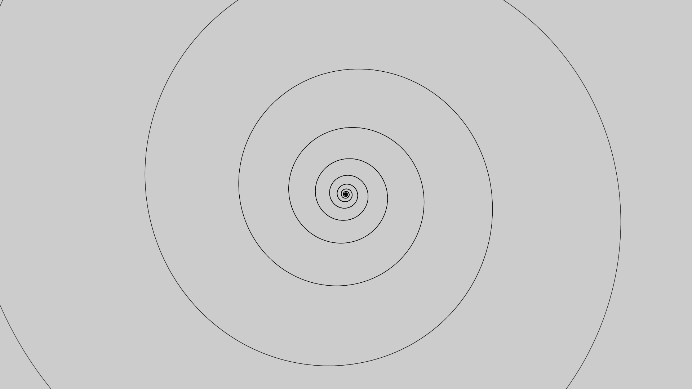

[Line](Line.flame)
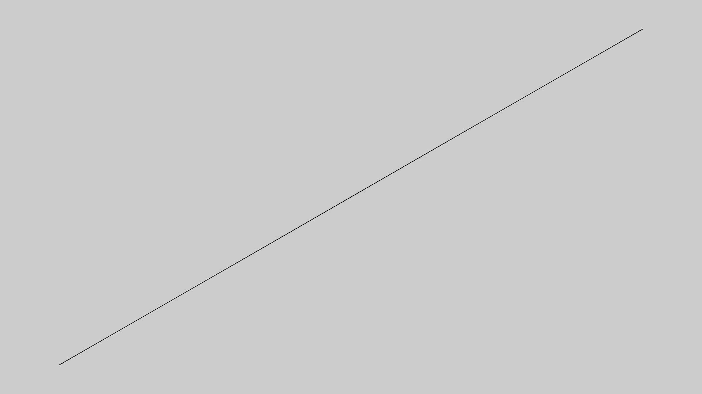

[Koch curve](KochCurve.flame)
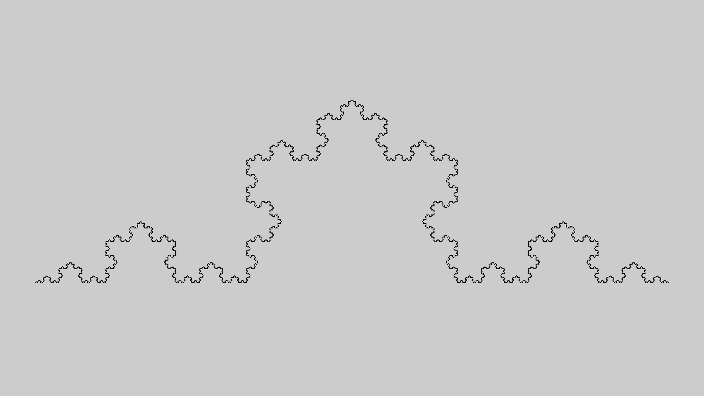

[De Jong](DeJong.flame)
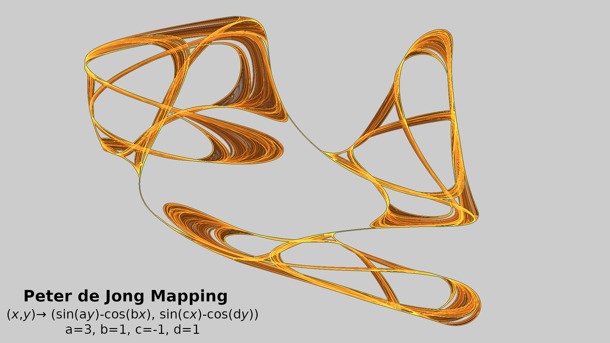

[IFS](IFS.flame)
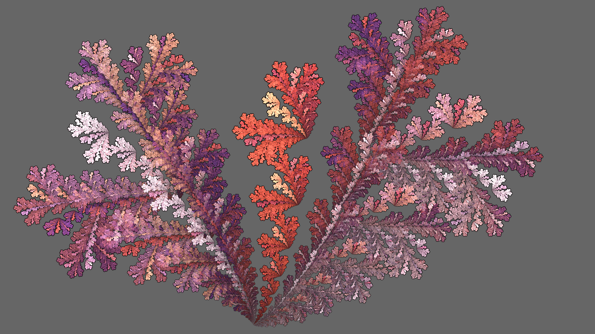

[Julia Circle](JuliaCircle.flame)
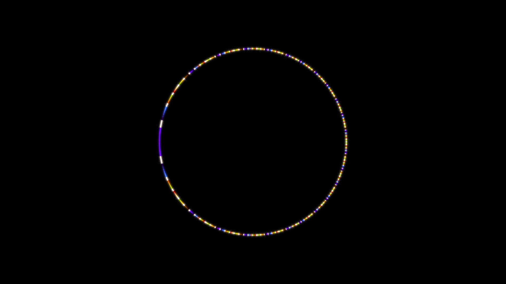

### Mandelbulber
[Mandelbulb](Mandelbulb.fract)
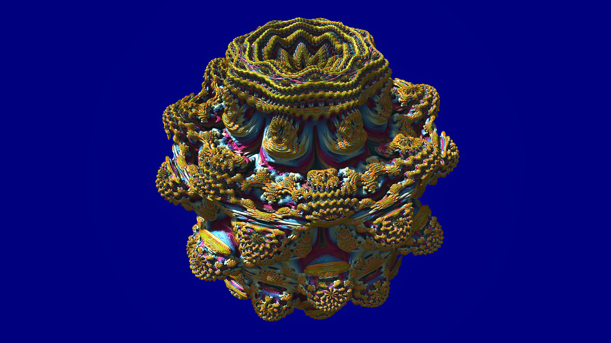

### Ultra Fractal
[Mandelbrot](Mandelbrot.upr)
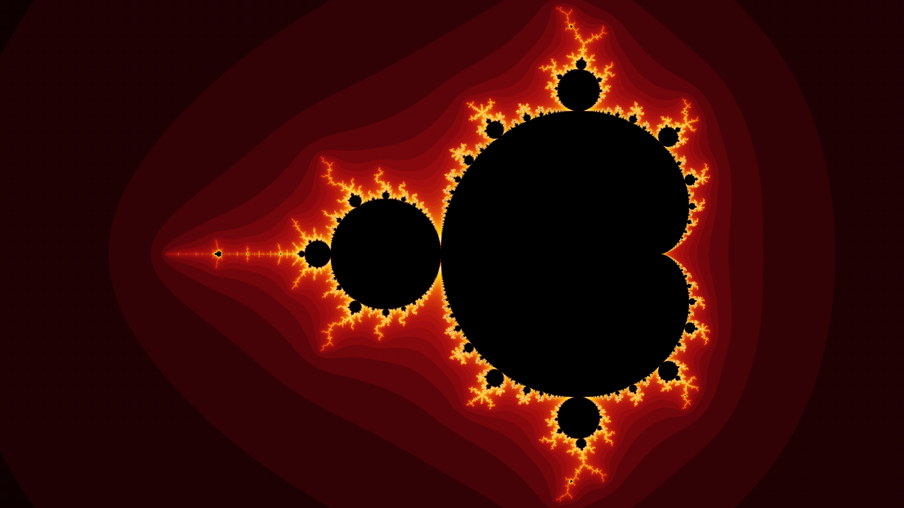

[Mandelbrot Zoom](Minibrot.upr)
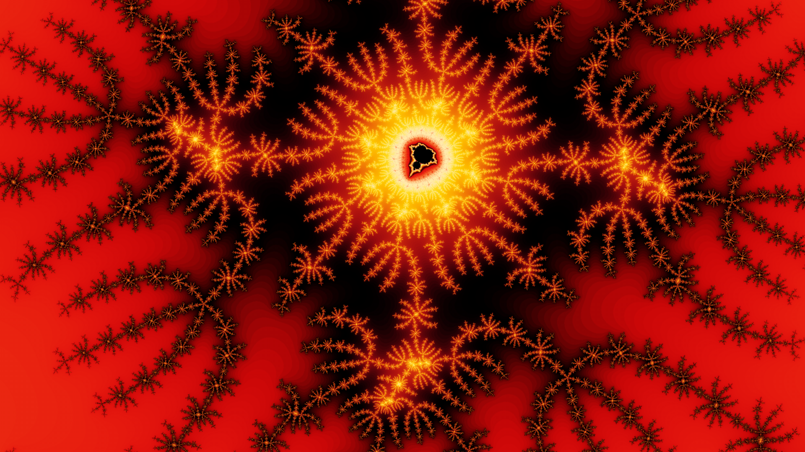

[Julia](Julia.upr)
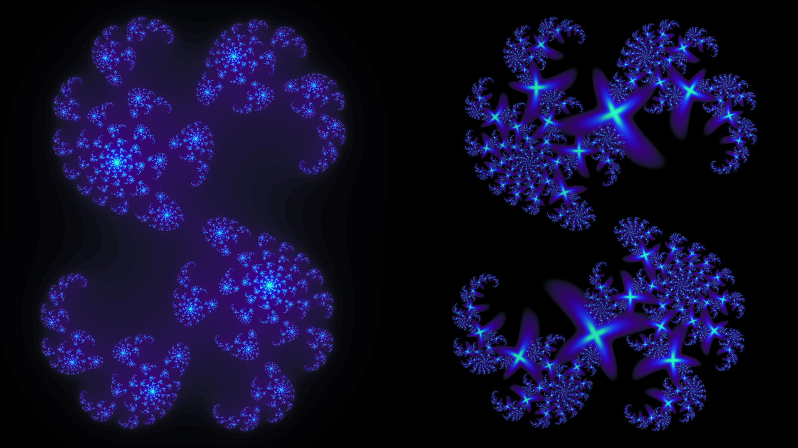

[Julia Circle](JuliaCircle.upr)
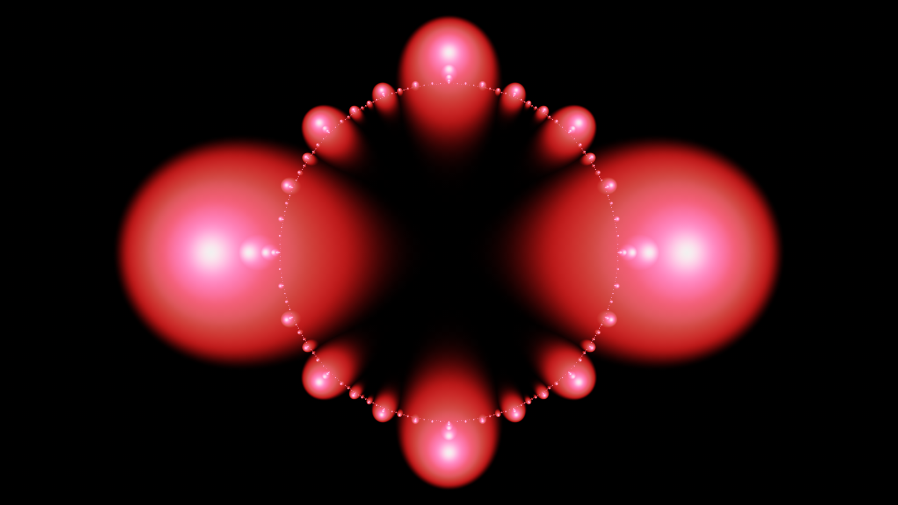

## Pictures
[Koch Curve Generator](koch.py) - Python program to generate the Koch curves of different orders shown in the video. The last line calls the curve function; change the second argument to whatever order you want to show.

[Dimension Pictures](Dimension.odg) - Pictures used to illustrate topological and fractal dimension in LibreOffice Draw format.

## Script
The script I used to create the video is at [script](Script.md).
