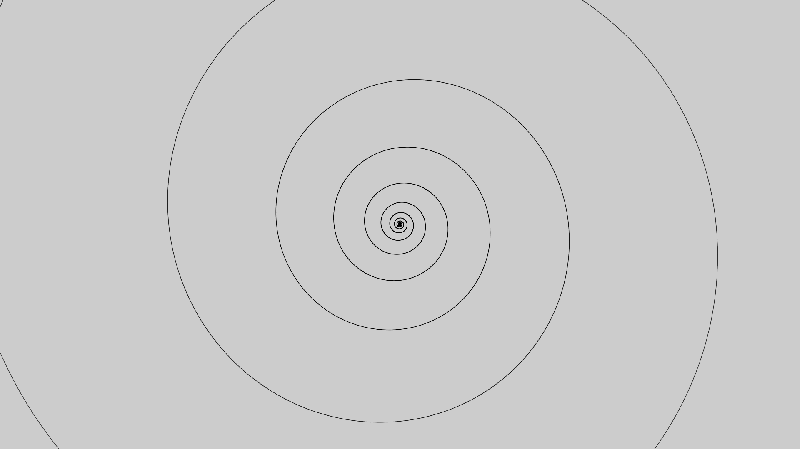
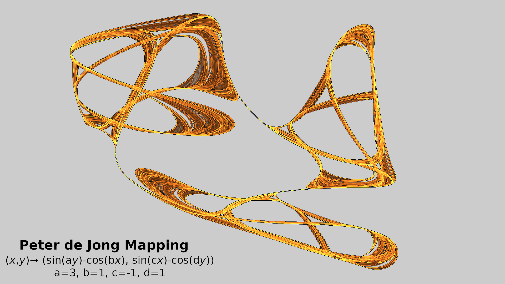
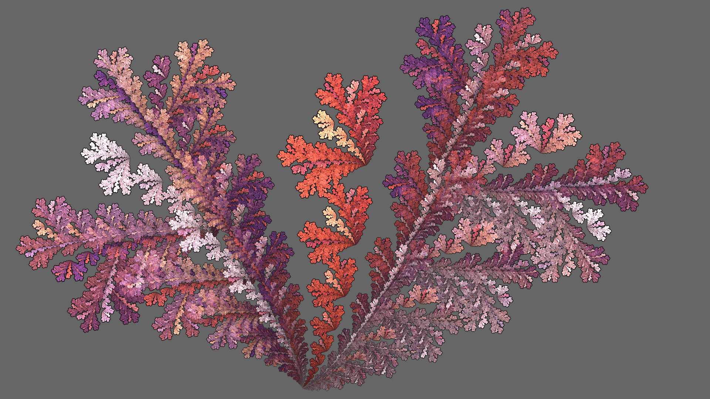
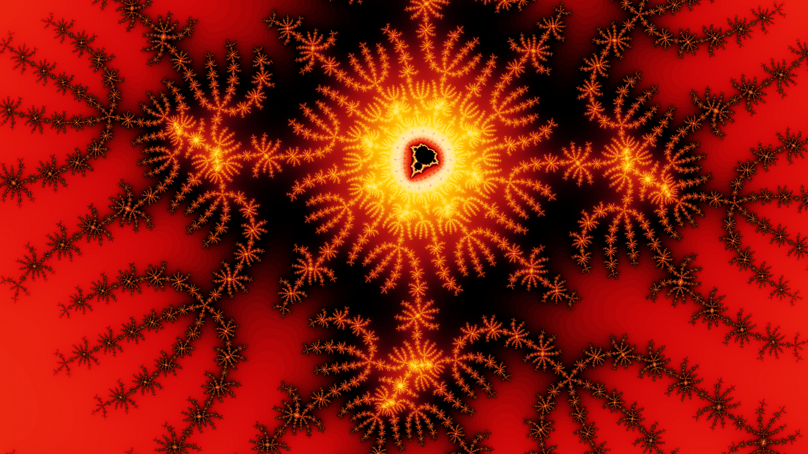
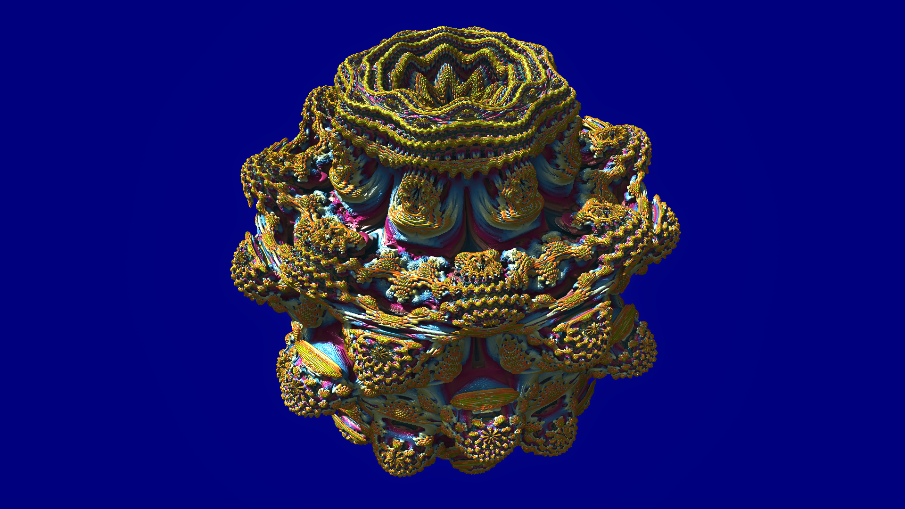
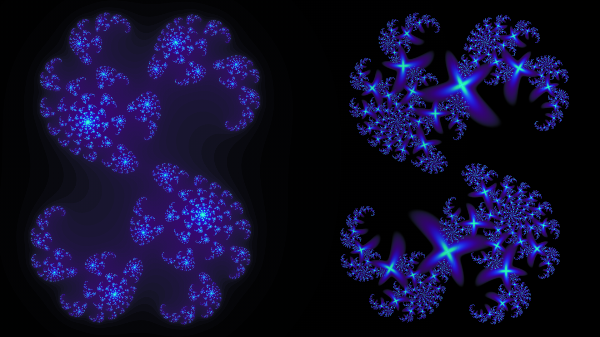
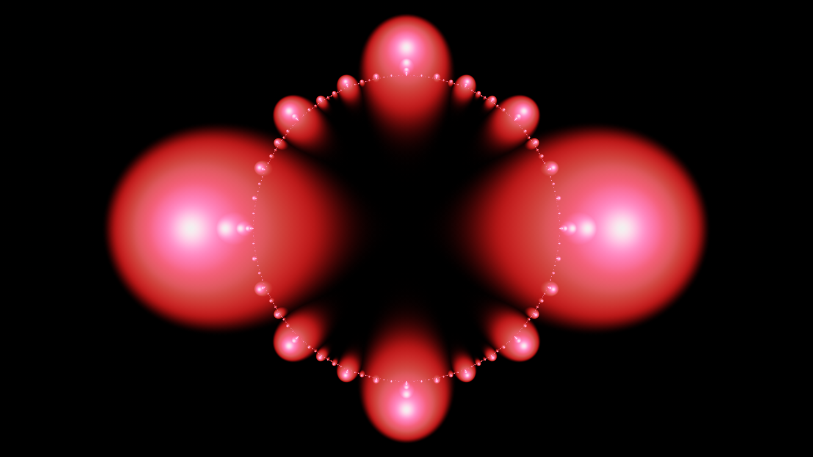

# What is a Fractal?

*(Camera on me)*

I started this YouTube channel about fractals and fractal art, so I figured it would be good to have an introductory video describing just what fractals are. This is motivated in part by a post someone recently made to one of the fractal related Facebook groups I follow. Facebook doesn't make it easy to find stuff you've already seen, so I can't find it anymore. But they asked a seemingly innocuous question: Is a spiral a fractal? There were lots of enthusiastic replies stating that yes, a spiral is a fractal. One person even explained their reasoning: if you zoom in to a spiral, you get a spiral; so a spiral is a fractal. Of course, by that reasoning, if you zoom into a line you get a line, so a line must be a fractal! And if you zoom into a spiral somewhere other than the center, you get a curved line, not a spiral.

*(Show JWildfire with the spiral showing)*

Let's explore this a bit. I'm using one of my favorite fractal programs, JWildfire, which I've programmed to make a spiral. If we zoom in *(slide Zoom slider slowly to the right)*, the spiral looks the same. If we zoom in even more *(slide Pixs per unit slider slowly to the right)*, it still looks pretty much the same. Mathematically, it is the same; the minor differences here are artifacts of the software. We can do the same thing with a line *(load line flame)*. When we zoom in *(slide Zoom slider slowly to the right)*, it's still a line. But let's go back to the spiral and reset the view *(set Pixs per unit to 65 and click Reset)*. Now let's zoom in to somewhere else on the spiral. I'll turn the guides on so we can see the center point, then move the spiral so it is centered on one of the arcs. Now when we zoom, it doesn't look so much like a spiral.

Compare this to a well-known fractal, the Koch curve *(load Koch curve flame)*. We'll see how to make it in a minute; for now, let's move some point on the curve to the center and zoom in. It still looks like a Koch curve. Zoom in more, and it is still a Koch curve. Let's reset and try a different point. Again, it looks the same when we zoom in.

*(Camera on me)*

So is a spiral a fractal? Let's come back to that question after we take a closer look at what a fractal is. There isn't an exact definition for fractal that everyone agrees on, but there are several characteristics that most agree a fractal should have. The first, and probably most well known, is the one we just looked at: self-similarity, the notion that a fractal looks the same at different scales. The Koch curve is a great example of this. We can see why it has this property when we look at how it is created.

*(Show first Koch curve image, a line; advance to the others as indicated)*

We start with a line segment, which we divide into three sections. We remove the middle section and replace it with two segments of the same length at a 60° angle. Now we have four connected line segments. We repeat the process for each of them, dividing each into three segments and replacing the middle one.

This makes 16 segments, and we do this again and again. Since each segment, no matter how small, gets the same treatment, the Koch curve will look exactly the same at any zoom level.

Self-similarity isn't always exact. For example, let's zoom into the famous Mandelbrot set. We'll use a program called XaoS, which is designed for real-time zooming.

*(Run Xaos, changing Iterations to 1700 and enabling anti-aliasing)*

The Mandelbrot set has an iconic shape, with a main cardiod shape surrounded by lots of smaller bulbs. Each of these bulbs has even smaller bulbs surrounding it. To zoom in XaoS, we just click where we want to zoom and it will zoom as long as we hold the mouse button. As we zoom in, we find smaller copies of the main set. This is one form of self-similarity. There are also points called Misiurewicz points, where we can zoom forever and see self-similarity, though the appearance is different for each point. The Mandelbrot set is infinitely interesting and beautiful, and we could spend hours exploring it. But let's go on.

*(Camera on me)*

Another well known characteristic of a fractal, indeed the one that Benoit Mandelbrot used, is that its fractal dimension is larger than its topological dimension. The mathematics of dimensions is surprisingly complex. In fact, the term "fractal dimension" can refer to one of a dozen or so types of dimension. We won't get too deep into the math here; any mathematicians that are watching may want to skip ahead a few minutes to avoid cringing! Fractal artists are rarely concerned with dimension, but you will probably encounter the term as you learn about fractals, so we'll try to get an intuitive feel for what it means.

Most people already have a basic understanding of topological dimension. Points have 0 dimensions, lines and curves have one dimension, surfaces have two dimensions, and solids have three dimensions. This is independent of the space the object is in. A point has a dimension of 0 even if it has a location in three dimensional space. A line that is bent into a circle, spiral, or Koch curve has a dimension of 1 even though the space it is defined in has at least two dimensions. The surface of a sphere has dimension 2, even though the solid it surrounds has dimension 3.

But mathematicians can't rely on intuition; they need something more formal. The general approach they use is to cover the object with balls. Let's work in two dimensions, so the "balls" are actually disks, or filled in circles. Let's start with a circle.

*(Start Draw presentation, displaying Page 1, a circle)*

We can cover it with balls however we want, like this. *(Page 2)* For every point in the object to be covered, the balls will overlap, so some points will be in more than one ball. But we need to minimize the overlap, so points are in as few balls as possible. To do this, we shrink the balls, like this. *(Page 3)* If we can cover the object with no overlap, the object has dimension 0. We can't do that here; there is no way to avoid covering some points with two balls. But no points are in three balls; two is the maximum, so this object has dimension 1.

*(Page 4)* Let's look at an object with dimension 2, a disk. When we cover it with balls, *(Page 5)* some points will be in a single ball and some points will be in two balls. But there is no way to avoid covering a few points with three balls. This means the object has dimension 2. If we were in three dimensional space, we would work with three dimensional balls, filled in spheres, and any covering of a solid object would require some points of the solid to be covered by four balls, meaning the object has dimension 3. The topological dimension is one less than the largest number of balls the points are in.

*(Page 6)* What about a Koch curve? We follow the same procedure, covering it with balls. *(Page 7)* In this case, some points are in two balls but none are in three, so the topological dimension is 1.

Fractal dimension is an interesting concept; it is a measure of how detail in an object changes with scale, which is what fractals are all about. Unlike topological dimension, which is always a natural number, fractal dimensions can be fractional. We approach it mathematically in the same way as we did topological dimension, by covering the object with balls. But this time, instead of looking for overlaps, we compare how many balls it takes to cover an object at various scales. Let's go back to our circle covered with balls.

*(Page 8)* Again, we try to avoid overlap as much as possible. In this case, the circle is nicely covered by nine balls of size 2.5. The units of the size are arbitrary, but it does imply that we are working in a space that has distance defined. The spaces we generally use do, but mathematicians have come up with lots of spaces that don't! Now we reduce the size of the balls and see how many balls it takes to cover the object with the smaller balls. *(Page 9)* In this case, we half the size from 2.5 to 1.25. Obviously, it will take more smaller balls; in this case we can cover the circle with 18 balls. It seems logical that when we half the size we double the number, but we'll see this isn't always the case. The formula for computing the fractal dimension is shown. Logarithms are a very useful tool in a mathematician's belt, but if you are not familiar it just think of it as the log button on your calculator. In the numerator, we divide the number of small balls by the number of large ones and take the log. In the denominator, we divide the size of the small balls by the size of the large ones and, again, take the log. For the circle, the fractal dimension is 1, the same as the topological dimension.

*(Page 10)* Let's try the same thing with the disk. Again, we cover it with 9 balls, slightly larger than before. And again we compare this with the covering with smaller balls. *(Page 11)* This time when we half the size, it takes four times as many balls to cover the disk. This makes sense because we double both dimensions and 2 times 2 is four. Plugging in the numbers, we get fractal dimension 2, again the same as the topological dimension. Using the characteristic that started this whole investigation into dimension, the fractal dimension is not greater then the topological dimension, so neither the disk nor the circle is a fractal.

It's encouraging that the fractal matches the topological dimension for non-fractals. But now let's see what happens when we apply this method to a fractal, specifically the Koch curve. *(Page 12)* Here is a Koch curve covered with 9 balls with size 2.6. Remember those numbers; we'll come back to them. When we half the size of the balls *(Page 13)* we now need 21 of them to cover the curve; a bit more than the 18 we needed for a circle. Now when we do the calculation, we get an interesting result: 1.22. That is actually a bit low. We can improve our accuracy by repeating the process. *(Page 14)* Halving the size again, we now need 52 balls to cover the Koch curve. Plugging in the current number and size with the original number and size (9 and 2.6), we get a new estimate for the fractal dimension: 1.265. That is pretty close; the actual value is 1.26186, so we're a bit high. We can get more accurate measurements by making the balls smaller and smaller.

*(Camera on me)*

OK. Enough math for this video! None of this was mathematically rigorous, but hopefully you now have a feel for how mathematicians approach the subject of dimension. As I said before, fractal artists don't normally think about fractal dimension too much. But scholars have used techniques like this to analyze art.

*(Show Jackson Pollock's Convergence)*

This is an image of Jackson Pollock's painting Convergence. This small reproduction doesn't do justice to the real thing, which is nearly 8 feet tall and 13 feet wide and has wonderful textures from the layers of paint he used to make it. Created in 1952, he didn't use a computer, and didn't know anything about fractals. Yet this and his other paintings have fractal dimensions between 1.3 and 1.5. This may explain the powerful aesthetics of his work.

*(Camera on me)*

The last characteristic we will examine is in some ways a bit strange because it focuses not on the fractal itself, but how it was defined. Specifically, it is that fractals have an iterative or recursive definition. Iterative means the process is repeated over and over. Recursive means it is defined in terms of itself. We saw an example of recursion in the Koch curve: the process to create it called for repeating that process on each new segment that was created. In fact, when the subject of recursion is taught in computer programming classes, a common exercise is to write a program to draw a Koch curve.

The geometric definition we used to define the Koch curve is just one of many ways to define fractals. (Indeed, only one of several ways to define the Koch curve.) The methods used by most fractal art programs are based on orbits of points. I guess we need just a bit more math...

We start by choosing a mapping from points to points. It takes a point and maps it to another point. For example, the Mandelbrot set we saw earlier uses a very simple mapping: $z → z^2+c$ . We start with some point and apply the mapping, getting a second point. Then we apply the mapping to that point, getting a third point. This is what is meant by iteration. The set of points we get by iterating this mapping is called the *orbit* of the point under the mapping.

*(Show Windows Calculator, in Standard mode)*

To better understand this concept, let's use a standard calculator to show some trivial, though boring, orbits. The points we'll be using are one dimensional, points on the number line. The mapping we'll start with is square root, which is this button. Let's pick the point 5 to start, and press square root. The result is a new point, 2.236. That's our first orbit point. We press square root again, and get the next orbit point, 1.495. We repeat and get 1.223, and we can keep going forever. Notice that the numbers keep getting closer and closer to 1, which is a special point. If we start with 1, we can press square root all we want and the answer will be 1; it's a trivial orbit. More importantly, it is what we call an *attractor* of the mapping, because it attracts points as we just saw. Let's start with a different point, 0.5. It's orbit is 0.707, 0.841, 0.917, and so forth. It gets attracted to 1.

Now let's look at the opposite mapping, square. Again, if we start with 1 we will stay there; 1 squared is 1, no matter how many times we iterate it. But watch what happens when we start just a tad higher, 1.01. The orbit values move away from 1, slowly at first, but eventually they get large very quickly; after just ten iterations it is over 26,000. Similarly, if we start at 0.99, just under 1, the numbers again move away from 1, though getting smaller and smaller. For this mapping, we call 1 a *repeller* since it pushes points away.

*(Show Peter de Jong mapping image)*

To make fractal art, we use much more interesting mappings. This is the attractor of a map attributed to Peter de Jong. It's a lot more interesting than a single point! The formula is shown; don't worry too much about what it means, but do notice that it has *parameters* a, b, c, and d. The particular values for this image are shown. Most fractal art programs provide a way for users to change parameters like these, which can produce very different results.

This shows one way to use a mapping to produce a fractal image: If the mapping has an attractor, we start with some random points and compute their orbits. The mapping will pull the orbit towards the attractor. Project each orbit point to the corresponding image pixel and color it somehow. Here, we use a single color; pixels corresponding to lots of orbit points are brighter than those corresponding to fewer, producing a density map of the attractor.

*(Show IFS image)*

Mappings can also combine multiple sub-mappings. This image is made with four affine mappings, which shrink the input point, that is move it towards the origin, rotate the point around the origin, and move it to produce the new point. The math term for this kind of mapping is Iterated Function System, or IFS, and it will be an attractor as long as certain conditions are met. We don't need to worry about those conditions when we are interacting with fractal software; if we do something and the fractal disappears, we aren't meeting the conditions, so we just back up and try something else. Iterated Function Systems are the basis of flame fractals, used by programs like JWildfire, which is what I used here. Some others are Apophysis, Chaotica, and Fractorium. Coloring is based on the particular sequence of submappings that reached a particular point.

*(Show Mandelbrot image)*

When the mapping is a repeller, as is the case with the Mandelbrot fractal, a different method is required to render it to an image. This image uses a method known as escape time. For each pixel in the image, we pick a representative point and start computing its orbit. If the point is outside the fractal, the mapping will repel it and it will get further and further away from the origin. When it reaches some threshold (1000 is used here), we say it *escapes*, so we know it is outside. The closer the point is to the fractal, the longer it will take to escape. The number of iterations it took to escape is the escape time, which is what we use to select a color. Points inside the fractal will not escape, so after some maximum iterations we give up and color it black.

*(Show Minibrot image)*

This method of rendering fractals is especially amenable to deep zooms. Unlike plotting orbit points, where a zoom will just mean most of the points are ignored since they are outside the image, with escape time we only look at points that are actually in the image. This image is magnified about 65 million times, which is frankly not very deep at all!

*(Show Mandelbulb image)*

But using escape time to color a fractal only works well in two dimensions. For three dimensional fractals, like this Mandelbulb, a different approach is used. We still use escape time, but now we use it to estimate the distance from a point to the fractal. Basically we shoot a ray from each pixel of the image towards the fractal. There isn't an easy way to tell where it intersects the fractal, or even if it does, so we need to move along the points of the ray until we reach the fractal. The distance estimate tells us how far we can move before checking again. The details are complex, but this can create stunning images of three dimensional fractals.

*(Show Julia image)*

Let's look at one more method to create images from a repeller mapping: orbit traps. This is a Julia fractal, closely related to the Mandelbrot fractal. The one on the left was rendered using the escape time method. The one on the right was rendered using orbit traps. Like escape time, we pick a point for each pixel in the image and compute its orbit. But now we compare each orbit point with a shape called a *trap*. Orbit points that lie inside the trap are, well, trapped, and used to determine the color of the pixel. There are lots of options; here the trap is shaped like an 'x', if more than one point is trapped, the one closest to the trap's center is used, and the distance of that point from the center is used to select the color. The result usually has lots of copies of the trap shape fractally distributed through the image, as we see here.

*(Camera on me)*

Let's go back to our question: Is a spiral a fractal? Technically not. It is only self similar at the center. It's fractal dimension is 1, the same as its topological dimension. Different types of spirals are defined by different mathematical formulas, but none are iterative or recursive.

But does it really matter? Fractal geometry provides methods for describing and analyzing complex systems that are intractable without it, but that doesn't mean we can't use those methods for simpler things like spirals or circles. There are just easier ways to do it. More to the point for fractal artists, fractal programs are certainly capable of producing images that aren't technically fractal. Does that mean we can't call them fractals? I don't think so. Let's look at one final example.

*(Show JWildfire with JuliaCircle loaded)*

This is the fractal program JWildfire again. I've used the julian variation to create a circle. by making small adjustments *(Drag left on O1 to increase its value)*, we get well-known fractals called Julia sets, closely related to the Mandelbrot set we zoomed into earlier. The circle is a special case, which many descriptions state is not a fractal. But is that really true? Let's add some color.

*(Change Coloring type to DISTANCE)*

The colors come from a gradient consisting of lots of narrow stripes. Notice how the stripes on the circle are far apart on the left and get closer and closer as they approach the right. We are limited by the gradient's finite structure, but this gives us a hint of the fractal structure of this circle. The fractal structure of this supposed non-fractal is even more apparent when using orbit traps.

*(Show Ultra Fractal with JuliaCircle loaded)*

Here is the same fractal in a different  program, Ultra Fractal, colored using an orbit trap that is a circle centered at the origin. We can see the trap better if we change the Julia seed to something besides 0 *(change Julia seed (IM) to 1)*. Now we can see the fractally distributed circles. *(Control-Z to undo seed change.)* But no fractal structure is apparent when the Julia seed is 0; it's just a circle. But watch what happens when we move the trap.

*(Click the Position 2 layer to show it.)*

There is a nice fractal structure here. If we zoom in, we see it persists at different scales.

*(Camera on me)*

So here is my conclusion: Fractal geometry provides useful tools for analyzing complex systems, and for producing unique and beautiful pieces of art. But don't worry too much about whether something is a fractal or not; it doesn't usually matter.
